# Sesion 2 - Manejo de entradas y salidas digitales

**Fecha**: 21/14/2023

> ## Objetivos
> * Identificar los diferentes elementos de hardware basico en la implementación de circuitos digitales.
> * Codificar programas para placas Arduino que hagan uso entradas y salidas digitales.
> * Emplear la comunicación serial como medio para hacer depuración en sistemas digitales.
>

## Hardware

En esta parte se describirá brevemente el hardware que será empleado a lo largo de la sesión. La siguiente tabla muestra todos los componentes que se emplearan para la siguiente practica.

|Ítem	|Componente	|Cantidad|
|---|---|---|
|1	|Arduino Uno R3|	1|
|2	|Cable de USB	|1|
|3	|Led Rojo	|2|
|4	|Led Verde	|2|
|5	|Led Amarillo|	2|
|6	|Led Azul	|2|
|7	|Resistencia 220 Ω| 	8|
|8	|Dip switch de cuatro posiciones|	1|
|9	|Pulsador	|2|
|10	|Led RGB cátodo común |	1|
|11	|Potenciometro de 10 k | 3|
|12	|Potenciometro de 10 k | 3|
|13	|Fotocelda | 1|

### Botones y switches

Componentes que permiten abrir o cerrar un circuito eléctrico.

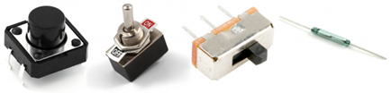

Para comprender el funcionamiento de algunos de los diferentes tipos de botones, se muestran como ejemplo el siguiente circuito con switches de diferentes tipos.

* **Esquematico**

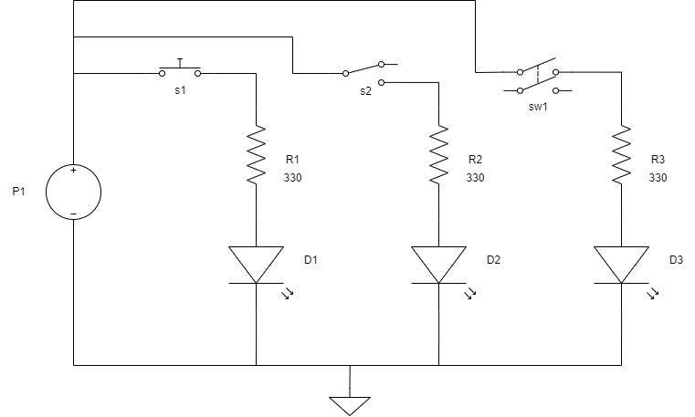

* **Montaje**

Para simular el funcionamiento siga al siguiente [link](https://www.tinkercad.com/things/lorSoGYHmFc)

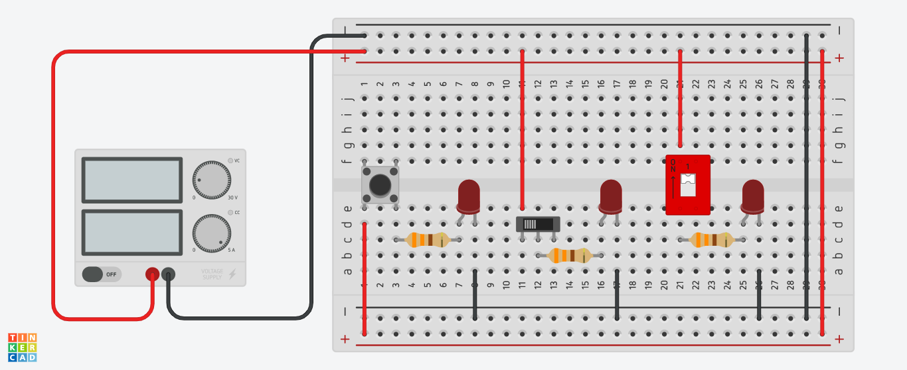

### Potenciometro

Resistencias variables, en nuestro caso se emplean como divisores de voltaje.

* **Esquematico**

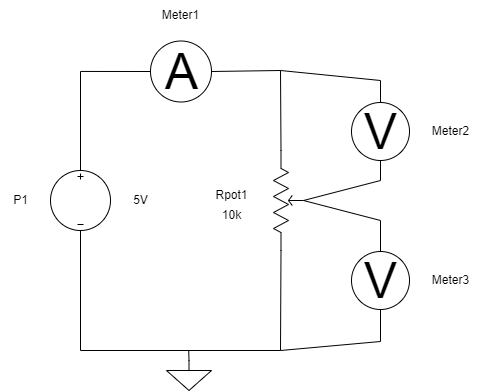

* **Montaje**

En la siguiente simulación ([link](https://www.tinkercad.com/things/ev7hGhFudkB)) se explora el funcionamiento del potenciometro como divisor de voltaje. 

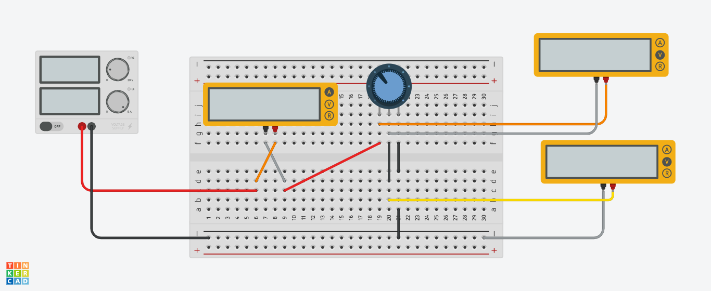

### Led

Un led (Light Emitting Diode) es un tipo especial de diodo que se caracteriza por convertir energia electrica en luz.

* **Esquematico**

En el siguiente esquematico se analiza el papel de la resistencia en un circuito basico con leds. 

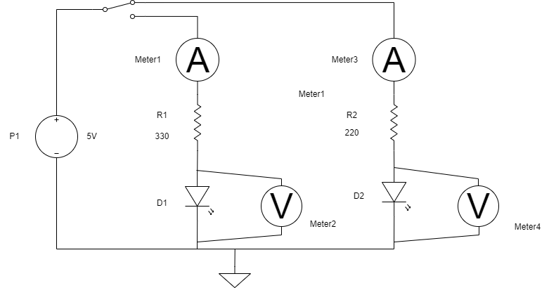

* **Montaje**

En el siguiente [link](https://www.tinkercad.com/things/2QE5sEyFMQ3) puede realizar la simulación para comprender el comportamiento del circuito.

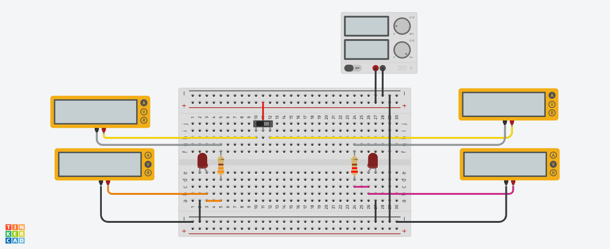

### Resistencia pull-up

Una resistencia de pull-up, es una resistencia que se emplea para fijar a una entrada digital a un voltaje alto (**H = 5V**)

* **Esquematico**

En el siguiente esquematico se ilustra el uso de una resistencia de pull-up.

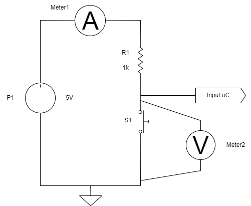

* **Montaje**

El siguiente montaje ([link](https://www.tinkercad.com/things/lXJNueOQMik)) simula el efecto de una resistencia de pull-up.

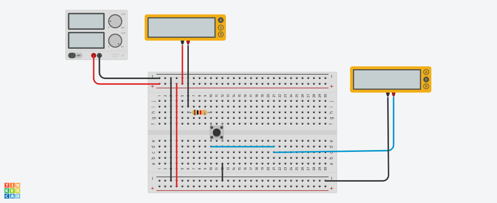

### Resistencia pull-down

Al contrario a una resistencia de pull-up, una resistencia de pull-down lleva a voltaje bajo (**L = 5V**) una entrada digital.

* **Esquematico**

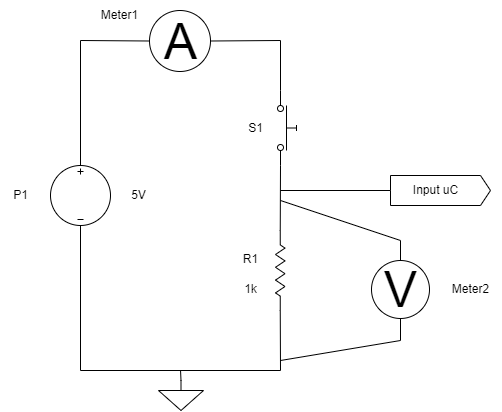

* **Montaje**

El siguente circuito simula el comportamiento de una resistencia del pull-down ([link](https://www.tinkercad.com/things/2DSoCphlLgf))

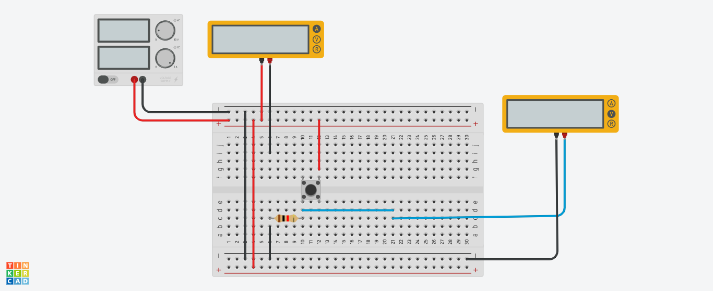

### Fotocelda

Las fotoceldas (tambien conocidas como LDR: light-dependent resistors ó CdS Cells: Cadmium-Sulfide) son sensores que permiten la detección de luz. 

Las fotoceldas son basicamente una resistencia que cambia su valor dependiendo de la cantidad de luz que recibe.

* **Esquematico**

En el siguiente esquematico se muestra un circuito tipico que hace uso de una fotocelda. En el siguiente [enlace](https://learn.adafruit.com/photocells/using-a-photocell) se explica mas a fondo el comportamiento de este circuito. 

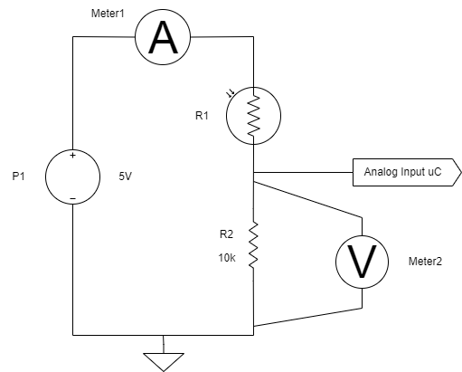

* **Montaje**

La simulación del circuito con fotocelda se muestra en el siguiente [link](https://www.tinkercad.com/things/5YY6M8EsIZt)

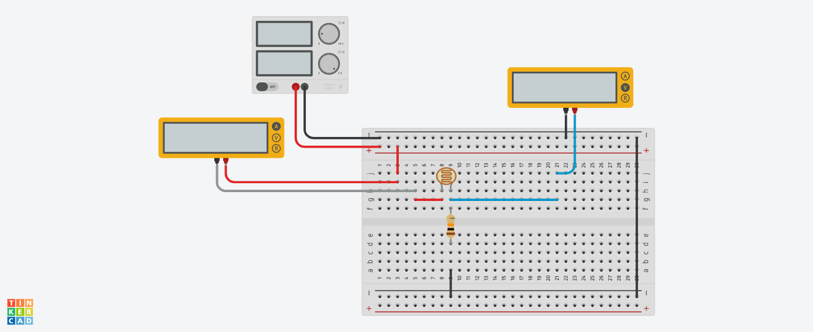

### Led RGB

Un led RGB RGB (Red-Green-Blue) es un tipo especial de LED que permite obtener luz en cualquier color como una combinación aditiva de los tres colores primarios de luz (Red - Green - Blue). Para ver los diferentes colores que se pueden obtener como una combinación de los colores primarios siga el siguiente [link](
https://www.rapidtables.com/web/color/RGB_Color.html)

* **Esquematico**

En el siguiente esquematico se muestra un selector de colores simples mediante el uso de switches.

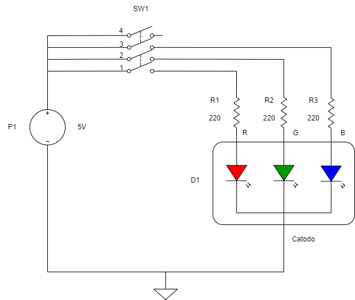

* **Montaje**

El circuito mostrado a continuación puede ser simulado a traves del siguiente [link](https://www.tinkercad.com/things/gSkzpr6DHcD)

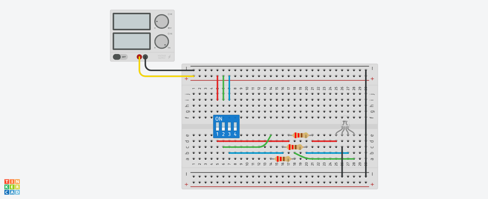

### Buzzer

En construcción... Disculpas por las molestias causadas.

## Actividad de laboratorio

La actividad a realizar en el laboratorio cosiste en desarrollar tanto en simulación (usando tinkercad) como en montaje (empleando el arduino UNO) los siguientes experimentos de la guia **Introducción: Arduino/Genuino SparkFun Inventor's Kit** ([link](https://learn.sparkfun.com/tutorials/sik-experiment-guide-for-the-arduino-101genuino-101-board-spanish)). A continuación se muestra una lista de circuitos a estudiar:
- [x] Experimento 1: Hacer parpadear un LED ([link](https://learn.sparkfun.com/tutorials/sik-experiment-guide-for-the-arduino-101genuino-101-board-spanish/experimento-1-hacer-parpadear-un-led))
- [ ] Experimento 2: Leer un potenciómetro ([link](https://learn.sparkfun.com/tutorials/sik-experiment-guide-for-the-arduino-101genuino-101-board-spanish/experimento-2-leer-un-potencimetro))
- [ ] Experimento 3: Controlar un LED RGB ([link](https://learn.sparkfun.com/tutorials/sik-experiment-guide-for-the-arduino-101genuino-101-board-spanish/experimento-3-controlar-un-led-rgb))
- [ ] Experimento 4: Controlar varios LED ([link](https://learn.sparkfun.com/tutorials/sik-experiment-guide-for-the-arduino-101genuino-101-board-spanish/experimento-4-controlar-varios-led))
- [ ] Experimento 5: Leer un pulsador ([link](https://learn.sparkfun.com/tutorials/sik-experiment-guide-for-the-arduino-101genuino-101-board-spanish/experimento-5-leer-un-pulsador))
- [ ] Experimento 7: Leer un fotorresistor ([link](https://learn.sparkfun.com/tutorials/sik-experiment-guide-for-the-arduino-101genuino-101-board-spanish/experimento-7-leer-un-fotorresistor))
- [ ] Experimento 8: Mezclar colores con el RGB ([link](https://learn.sparkfun.com/tutorials/sik-experiment-guide-for-the-arduino-101genuino-101-board-spanish/experimento-8-mezclar-colores-con-el-rgb))

## Referencias

Para profundizar mas a fondo todo lo visto anteriormente tratado:
1. SparkFun Inventor's Kit Experiment Guide - v4.1 ([link](https://learn.sparkfun.com/tutorials/sparkfun-inventors-kit-experiment-guide---v41/introduction))
2. Introducción: Arduino/Genuino SparkFun Inventor's Kit ([link](https://learn.sparkfun.com/tutorials/sik-experiment-guide-for-the-arduino-101genuino-101-board-spanish))
3. Learn Arduino ([link](https://learn.adafruit.com/groups/learn-arduino))
4. Button and Switch Basics ([link](https://learn.sparkfun.com/tutorials/button-and-switch-basics/all))
5. Electric Power ([link](https://learn.sparkfun.com/tutorials/electric-power))
6. How to Power a Project ([link](https://learn.sparkfun.com/tutorials/how-to-power-a-project))
7. Pull-up Resistors ([link](https://learn.sparkfun.com/tutorials/pull-up-resistors))
8. Voltage Dividers ([link](https://learn.sparkfun.com/tutorials/voltage-dividers))
9. Pulse Width Modulation ([link](https://learn.sparkfun.com/tutorials/pulse-width-modulation))
10. Resistors ([link](https://learn.sparkfun.com/tutorials/resistors))
11. Diodes ([link](https://learn.sparkfun.com/tutorials/diodes))
12. Light-Emitting Diodes (LEDs) ([link](https://learn.sparkfun.com/tutorials/light-emitting-diodes-leds))
13. Light ([link](https://learn.sparkfun.com/tutorials/light))
14. Distance Sensing Overview ([link](https://www.sparkfun.com/distance_sensing?_ga=2.97125471.1305858152.1676925544-2025443212.1674610637))
15. Photocell Hookup Guide ([link](https://learn.sparkfun.com/tutorials/photocell-hookup-guide?_ga=2.227174749.1305858152.1676925544-2025443212.1674610637))
16. Photocells ([link](https://learn.adafruit.com/photocells))
17. IR Sensor ([link](https://learn.adafruit.com/ir-sensor))
18. Raspberry Pi Computer Quick-Start ([link](https://learn.adafruit.com/raspberry-pi-computer-quick-start))