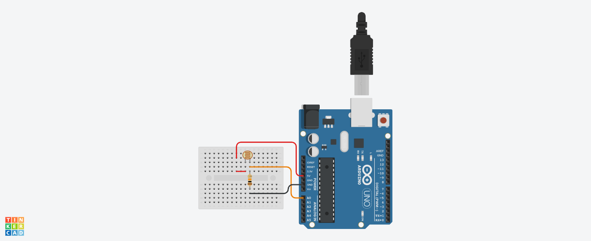

# Sesion 3 - Manejo de una fotocelda

## Introducción

El componente principal a analizar en este caso es la fotocelda o fotoresistencia. Existen referencias como la **GL5528** ([datasheet](http://cdn.sparkfun.com/datasheets/Sensors/LightImaging/SEN-09088.pdf)) o la **PVD-P8001** ([datasheet](https://cdn-learn.adafruit.com/assets/assets/000/010/127/original/PDV-P8001.pdf)), sin embargo, todas en cuanto a su funcionamiento y su uso son similares:


Para comprender mas sobre estas, se recomienda que mire los siguientes enlaces:
1. **Photocells** ([link](https://learn.adafruit.com/photocells/))
2. **Photocell Hookup Guide** ([link](https://learn.sparkfun.com/tutorials/photocell-hookup-guide/all))


## Ejemplo 1

### Hardware

Los siguientes son los materiales que se emplearán en el siguiente montaje:

|N°|Componente|Cantidad|
|---|---|---|
|1|Arduino UNO|1|
|2|Fotocelda|1|
|3|Resistencia 10k|1|
|4|Resistencia 220|1|
|5|Led|1|


### Software

El siguiente codigo fue tomado del tutorial de fotoceldas de Adafruit: **Photocells** ([link](https://learn.adafruit.com/photocells/)) la simulación se encuentra en el siguiente [link](https://www.tinkercad.com/things/2ZHZUO1Hi6r):

```ino
/* Photocell simple testing sketch. 
 
Connect one end of the photocell to 5V, the other end to Analog 0.
Then connect one end of a 10K resistor from Analog 0 to ground 
Connect LED from pin 11 through a resistor to ground 
For more information see http://learn.adafruit.com/photocells */
 
int photocellPin = 0;     // the cell and 10K pulldown are connected to a0
int photocellReading;     // the analog reading from the sensor divider
int LEDpin = 11;          // connect Red LED to pin 11 (PWM pin)
int LEDbrightness;        // 

void setup(void) {
  // We'll send debugging information via the Serial monitor
  Serial.begin(9600);   
}
 
void loop(void) {
  photocellReading = analogRead(photocellPin);  
 
  Serial.print("Analog reading = ");
  Serial.println(photocellReading);     // the raw analog reading
 
  // LED gets brighter the darker it is at the sensor
  // that means we have to -invert- the reading from 0-1023 back to 1023-0
  photocellReading = 1023 - photocellReading;

  //now we have to map 0-1023 to 0-255 since thats the range analogWrite uses
  LEDbrightness = map(photocellReading, 0, 1023, 0, 255);
  analogWrite(LEDpin, LEDbrightness);
 
  delay(100);
}
```


## Ejemplo 2

### Hardware

Los siguientes son los materiales que se emplearán en el siguiente montaje:

|N°|Componente|Cantidad|
|---|---|---|
|1|Arduino UNO|1|
|2|Fotocelda|1|
|3|Resistencia 10k|1|



### Software

Este código tambien fue tomado del tutorial de fotoceldas de Adafruit: **Photocells** ([link](https://learn.adafruit.com/photocells/)) la simulación se encuentra en el siguiente [link](https://www.tinkercad.com/things/kfiOjk7UVHi):

```ino
/* Photocell simple testing sketch. 
 
Connect one end of the photocell to 5V, the other end to Analog 0.
Then connect one end of a 10K resistor from Analog 0 to ground
 
For more information see http://learn.adafruit.com/photocells */
 
int photocellPin = 0;     // the cell and 10K pulldown are connected to a0
int photocellReading;     // the analog reading from the analog resistor divider
 
void setup(void) {
  // We'll send debugging information via the Serial monitor
  Serial.begin(9600);   
}
 
void loop(void) {
  photocellReading = analogRead(photocellPin);  
 
  Serial.print("Analog reading = ");
  Serial.print(photocellReading);     // the raw analog reading
 
  // We'll have a few threshholds, qualitatively determined
  if (photocellReading < 10) {
    Serial.println(" - Dark");
  } else if (photocellReading < 200) {
    Serial.println(" - Dim");
  } else if (photocellReading < 500) {
    Serial.println(" - Light");
  } else if (photocellReading < 800) {
    Serial.println(" - Bright");
  } else {
    Serial.println(" - Very bright");
  }
  delay(1000);
}
```
## Referencias


* https://makeabilitylab.github.io/physcomp/sensors/photoresistors.html
* https://learn.sparkfun.com/tutorials/photocell-hookup-guide?_ga=2.134332913.1669424074.1678683217-2025443212.1674610637
* https://www.sparkfun.com/products/9088
* https://learn.adafruit.com/photocells/using-a-photocell


