# Sesion 4 - Led y display de siete segmentos

**Fecha**: 14/03/2023

> ## Objetivos
> * Comprender el uso de Leds como elementos de indicación visual de sistemas electronicos
> * Desarrollar sistemas electronicos empleando arduino y leds.
> * Aprender a instalar librerias de terceros en el IDE de Arduino.

## Conceptos Teóricos

### LED - Diodo emisor de luz

Estos diodos son diseñados para generar luz cuando una cantidad suficiente de corriente pasa a través del dispositivo. Los voltajes de polarización directa a través de un LED suelen ser mayores que los de los diodos de silicio, variando típicamente entre 1.2 y 3.2 V según el diodo. La siguiente figura muestra un diodo led típico:

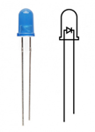

Los materiales mas utilizados para la construcción de leds son:

|Material|Simbolo|Radiación|
|-----|------|------|
|Arseniuro de Galio|GaAs|Infraroja|
|Fosfuro Arseniuro de Galio|GaAsP|rojo|
|Fosfuro de Galio|GaP|rojo, naranja, verde|
|Fosfuro Arseniuro de Galio-aluminio|GaAlAsP|rojo, amarillo, verde|
|Fosfuro Arseniuro de Galio-aluminio|GaAlAsP|rojo, amarillo, verde| 

Los valores de corriente y voltaje asociados al led, se pueden consultar de las hojas de datos, pero con el fin de realizar cálculos rápidos se suelen utilizar las siguientes referencias dependiendo del tipo de Led:

|Material semiconductor|Longitud de onda ($\lambda$)|Color|Voltaje directo aproximado $(V_F\ @\ 20mA)$|
|---|---|---|---|
|GaAs|850 – 940 nm|Infra rojo|~1.2 V|
|GaAsP|630 – 660 nm|Rojo|~1.8 V|
|GaAsP|605 – 620 nm|Ámbar|~2 V|
|GaAsP:N|585 – 595 nm|Amarillo|~2.2 V|
|AlGaP|550 – 570 nm|Verde|~3.5V|
|SiC|430 – 505 nm|Azul|~3.6V|
|GaInM|450 nm|Blanco|~4.0V|

### Polarización de los Leds

Los LEDs funciónan polarizandose en directa en un circuito similar al mostrado en la siguiente figura:

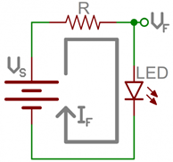

Al analizar el circuito anterior por KVL tenemos que:

$$-V_S+RI_F+V_F=0$$

Luego el valor de la resistencia estará dado por:

$$R= \frac{V_S-V_F}{I_F}$$

Donde:
* $V_S$: Voltaje de alimentación (fuente de voltaje, pila, voltaje de salida de un puerto).
* $V_F$: Voltaje directo del LED.
* $I_F$: Corriente deseada en el LED.

La resistencia (mostrada en el circuito anterior), se emplea para limitar la cantidad de corriente que pasa a través de un LED y asegurar que este no se queme cuando se aplica energía. Para esto, al conectarse una resistencia en serie con un LED, la corriente que fluye a través de ambos componentes se puede limitar a un valor seguro.

Por ejemplo, si se tiene un led rojo conectado a través de una resistencia a una salida digital, cuyo voltaje en alto es de $5V$ y se quiere limitar la salida de corriente a $10\ mA$ asumiendo que el voltaje directo para un led rojo es de $1.8\ V$, el valor de la resistencia limitadora estará dado por:

$$R= \frac{V_S-V_F}{I_F} = \frac{5-1.8}{10\times10^{-3}}= 320\Omega \approx 330\Omega$$

### Display de siete segmentos

Un display de 7 segmentos es un módulo de visualización digital especializado, en el que los LEDs con dispuestos de tal forma que hace facilita la visualizanción de información numérica.

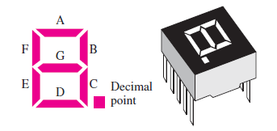

Como se muestra en la siguiente figura, cada segmento (incluyendo el punto) tiene un nombre asociado:

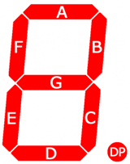

 En la siguiente tabla, se muestra como digito encendiendo y apagando la secuencia de segmentos apropiados:

|Numero|	A|	B|	C|	D|	E|	F|	G|	DP|
|---|---|---|---|---|---|---|---|---|
|0	|ON|	ON|	ON|	ON|	ON|	ON|	OFF|	-|
|1	|ON|	ON|	ON|	ON|	ON|	ON|	ON|	-|
|2	|OFF|ON|	ON|	ON|	ON|	ON|	ON|	-|
|3	|ON|ON|	ON|	ON|	ON|	ON|	ON|	-|
|4	|OFF|ON|	ON|	OFF|	OFF|	ON|	ON|	-|
|5	|ON	|OFF|	ON|	ON	|OFF	|ON|	ON|	-|
|6	|ON	|OFF|	ON|	ON	|ON	|ON|	ON|	-|
|7	|ON	|ON|ON|	OFF	|OFF	|OFF|	OFF|-|
|8	|ON	|ON|ON|	ON	|ON	|ON	|ON|	-|
|9	|ON	|ON|ON|	ON|	OFF|	ON|	ON|	-|
|A	|ON	|ON|	ON|	OFF|	ON|	ON|	ON|	-|
|B	|OFF|	OFF|	ON|	ON|	ON|	ON|	ON|	-|
|C	|ON	|OFF|	OFF|	ON|	ON|	ON|	ON|	-|
|D	|OFF|	ON|	ON|	ON	|ON	|OFF|	ON|	-|
|E	|ON	|OFF|	OFF|	ON|	ON|	ON|	ON|	-|
|F	|ON|	ON|	OFF	|OFF|	ON|	ON|	ON|	-|

Existen dos tipos de display de 7 segmentos:

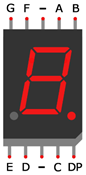

1. **Anodo común**:  Se caracteriza por que el pin común es el anodo de todos los segmentos. Esto hace que para activar un segmento determinado se use logica negativa (Encendido a 0 V).

   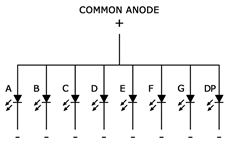

   Para comprender el funcionamiento realice la simulación ([link](https://www.tinkercad.com/things/gyAMeONbyWg)) del circuito mostrado a continuación:

   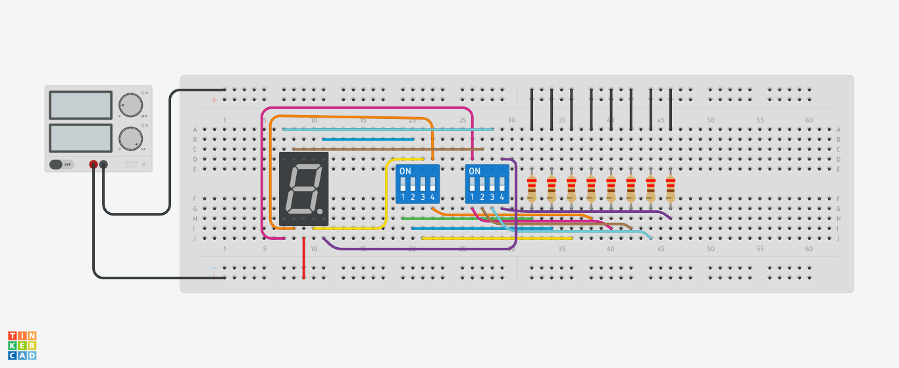

2. **Catodo común**:  Se caracteriza por que todos los segmentos comparten el mismo catodo. Para activar un segmento determinado se usa logica positiva (Encendido a 5 V).

   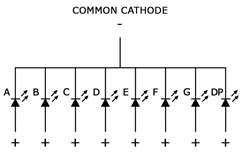

   En el siguiente [link](https://www.tinkercad.com/things/eFNHQikGh22) se simula el siguiente circuido en el que se usa un display de siete segmentos de catodo común:

   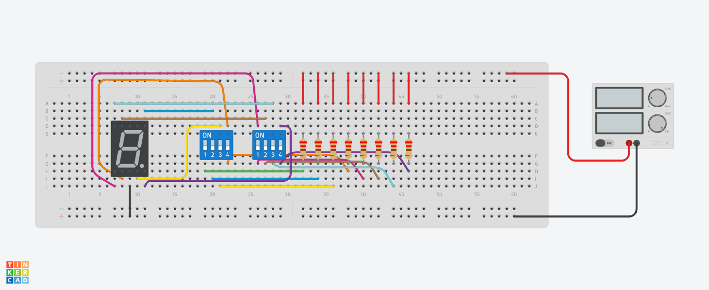

### Arduino y display de siete segmentos

#### Ejemplo 1

En el siguiente ejemplo se muestra un display de siete segmentos de Anodo común conectado a un arduino. El programa que ejecuta el arduino se encarga implementar un contador que cuenta desde 0 hasta 9 de manera que se despliega el valor en el display. La siguiente figura muestra el circuito asociado:

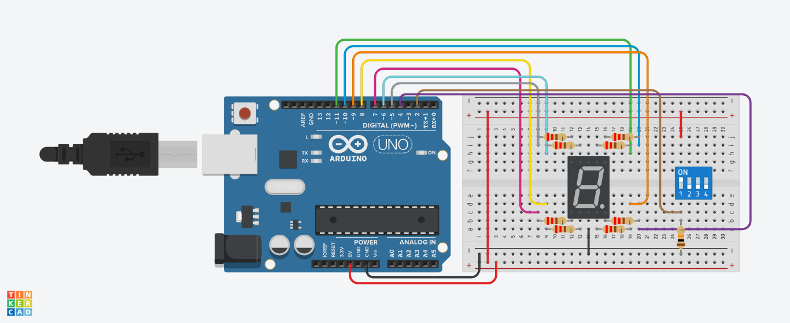

El código ([simulación](https://www.tinkercad.com/things/3DYyBx2WnZa)) que se ejecuta en el arduino se muestra a continuación.

```ino
const int NUMBERS[10] = { 0b1000000, // 0
                          0b1111001, // 1
                          0b0100100, // 2
                          0b0110000, // 3
                          0b0011001, // 4
                          0b0010010, // 5
                          0b0000010, // 6
                          0b1111000, // 7
                          0b0000000, // 8 
                          0b0010000  // 9
                         };

#define SEG_A 11
#define SEG_B 10
#define SEG_C 9
#define SEG_D 8
#define SEG_E 7
#define SEG_F 6
#define SEG_G 5


#define NUM_SEGMENTS 7 

/* --- Entradas/Salidas --- */
// Segmentos: A - G
const int SEGMENT_PORTS[] = {SEG_A, 
                            SEG_B,
                            SEG_C,
                            SEG_D,
                            SEG_E,
                            SEG_F,
                            SEG_G,
                            };

#define SEG_DP 4 // Segmento DP
#define SW 2     // Switche que controla el segmento DP

/* --- Variables --- */
int counter;
int sw_val = 0;

/*--- Inicialización ---*/
void setup() {
  pinMode(SW,INPUT);
  init_seven_segment_ports();  
  counter = 0;
}

/*--- Ciclo infinito ---*/
void loop() {
  sw_val = digitalRead(SW);
  digitalWrite(SEG_DP,sw_val);
  display_number(counter);
  if(counter < 9) {
    counter++;
  }
  else {
    counter = 0;
  }
  delay(1000); 
}

void init_seven_segment_ports() {
  for(int i = 0; i <= NUM_SEGMENTS; i++) {
    pinMode(SEGMENT_PORTS[i], OUTPUT);
  } 
}

int get_bit(int number, int num_bit) {
  return (number>>num_bit)&(0b0000001);
}

void display_number(int number) {
  int bit;
  int disp_sec = NUMBERS[number];
  for(int i = 0; i < NUM_SEGMENTS; i++) {  
    bit = get_bit(disp_sec,i);
    digitalWrite(SEGMENT_PORTS[i],!bit);
  }
}
```

En este caso se implementa, a partir de las funciones basicas del API de Arduino ([link](https://www.arduino.cc/reference/en/)), las funciones necesarias para controlar el display. 

#### Ejemplo 2

En el siguiente ejemplo, a diferencia del ejemplo anterior, se hace uso de librerias hechas por terceros para el control del display. Para saber como se instala una libreria se recomienda que revise la pagina de Sparkfun **Installing an Arduino Library** ([link](https://learn.sparkfun.com/tutorials/installing-an-arduino-library/all#:~:text=Using%20the%20Arduino%20Library%20Manager&text=When%20you%20open%20the%20Library,you%20want%20should%20show%20up.)). 

En este caso se va a instalar la libreria **Seven Segment Library** de Derek Duncan ([link](https://github.com/dgduncan/SevenSegment)). Lo cual se hace dando click en: **Tools > Manage Libraries...** y colocando en el **library manager** (desplegado a la izquierda) el nombre de la libreria o el nombre del autor (lo cual se hizo en nuestro caso), tal y como se muestra a continuación:

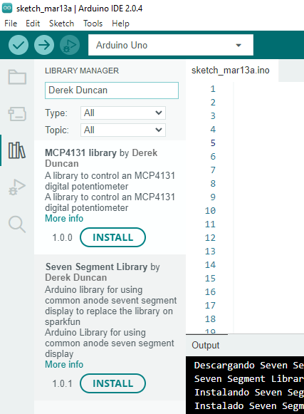

Una vez hecho esto, se puede codificar el programa ([simulación](https://wokwi.com/projects/359034061790323713)) mostrado a continuación:

```ino
#include "SegmentDisplay.h"

/*
 10 9 CA  7  6
 |  |  |  |  |
 _____________
|             |
|             |
|             |
|             |
|             |
|             |
|             |
|_____________|
 |  |  |  |  |
 1  2  CA 4  5

-------------------
|Pin| Descripción |
-------------------
|1  |      E      |
|2  |      D      |
|CA | Adodo Comun |
|4  |      C      |
|5  |      DP     |
|6  |      B      |
|7  |      A      |
|CA | Adodo Comun |
|9  |      F      |
|10 |      G      |
-------------------

*/

// --------------- Conexiones --------------- //

// Segmentos
#define SEG_A 11   // A
#define SEG_B 10   // B
#define SEG_C 9    // C
#define SEG_D 8    // D
#define SEG_E 7    // E
#define SEG_F 6    // F
#define SEG_G 5    // G
#define SEG_DP 2   // DP

// Switch
#define SW 3  // Controla el encendido y apagado del punto en el display


// --------- Variables del programa -------- // 
int counter;
int t = 500;
int sw_value;

// Pines display                1       2     4      5      6      7      9     10                        
SegmentDisplay segmentDisplay(SEG_E, SEG_D, SEG_C, SEG_DP, SEG_B, SEG_A, SEG_F, SEG_G);

// --------- Rutina de inicialización -------- //
void setup() {
  // Pin switch
  pinMode(SW, INPUT);
  // Inicialización del contador
  counter = 0; 
  // Inicialización del switch
  sw_value = digitalRead(SW);
}

void loop() {  
  sw_value = digitalRead(SW);
  segmentDisplay.displayHex(counter, sw_value);
  delay(t);
  // Validacion del valor maximo del contador
  if(counter >= 15) {
    counter = 0;
  }
  else {
    counter++;
  }  
}

```

El diagrama de conexión se muestra a continuación:

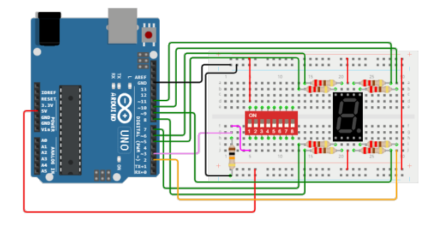

## Actividad

Usando un MCU Arduino y dos display de 7 segmentos implemente un contador de **Incremento/decremento** de 00 a 99.

El contador se controla mediante tres señales digitales:
* Un botón de **Comienzo/Parada**
* Un botón de **Reinicio** 
* Un switch de **Incremento/Decremento**.


## Referencias

1. Arduino Libraries ([link](https://learn.adafruit.com/adafruit-all-about-arduino-libraries-install-use/arduino-libraries))
2. Installing an Arduino Library ([link](https://learn.sparkfun.com/tutorials/installing-an-arduino-library/all#:~:text=Using%20the%20Arduino%20Library%20Manager&text=When%20you%20open%20the%20Library,you%20want%20should%20show%20up.))
