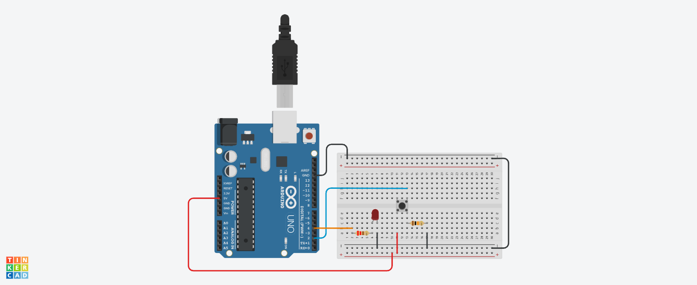
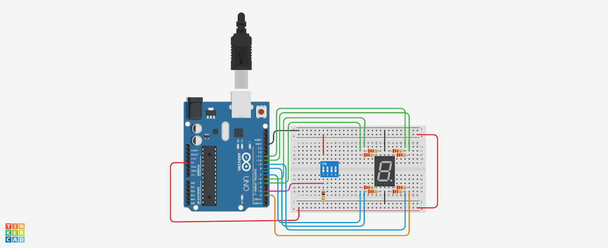

# Ejemplo por pasos

## Circuito 1

Montar el siguiente circuito:



Despues de montado, implementar los siguientes tres códigos y mirar como funcionan:

### Codigo 1 - Contador con debounce

En el siguiente [link](https://www.tinkercad.com/things/i1HxflPgGVp) se puede ver la simulación, sin embargo montelo y observe que sucede:

```ino
// C++ code

// constants won't change. They're used here to set pin numbers:
const int buttonPin = 2;  // the number of the pushbutton pin
const int ledPin = 4;    // the number of the LED pin


// Variables will change:
int ledState = HIGH;        // the current state of the output pin
int buttonState;            // the current reading from the input pin
int lastButtonState = LOW;  // the previous reading from the input pin
int button_counter = 0;
  
void setup()
{
  pinMode(buttonPin, INPUT);
  pinMode(ledPin, OUTPUT);
  // set initial LED state
  digitalWrite(ledPin, ledState);
  Serial.begin(9600);
  Serial.println("Contador de pulsaciones: ");
  Serial.println(button_counter);
}

void loop() {
  int reading = digitalRead(buttonPin);
  // if the button state has changed:
  if (reading != buttonState) {
    buttonState = reading;    
    // only toggle the LED if the new button state is HIGH
    if (buttonState == HIGH) {
      ledState = !ledState;
      button_counter++;
      Serial.println(button_counter);
    }
  }
  // set the LED:
  digitalWrite(ledPin, ledState);
  // save the reading. Next time through the loop, it'll be the lastButtonState:
  lastButtonState = reading;
}
```

### Codigo 2 - Contador con anti-debounce

En el siguiente [link](https://www.tinkercad.com/things/fobxpIDyz92) se puede ver la simulación. Sin embargo, en este ejemplo se puede ver la solución al problema que se dio en el montaje del ejemplo anterior:

```ino
// constants won't change. They're used here to set pin numbers:
const int buttonPin = 2;  // the number of the pushbutton pin
const int ledPin = 4;    // the number of the LED pin


// Variables will change:
int ledState = HIGH;        // the current state of the output pin
int buttonState;            // the current reading from the input pin
int lastButtonState = LOW;  // the previous reading from the input pin
int button_counter = 0;


// the following variables are unsigned longs because the time, measured in
// milliseconds, will quickly become a bigger number than can be stored in an int.
unsigned long lastDebounceTime = 0;  // the last time the output pin was toggled
unsigned long debounceDelay = 50;    // the debounce time; increase if the output flickers


void setup() {
  pinMode(buttonPin, INPUT);
  pinMode(ledPin, OUTPUT);
  // set initial LED state
  digitalWrite(ledPin, ledState);
  Serial.begin(9600);
  Serial.println("Contador pulsaciones: ");
  Serial.println(button_counter);
}

void loop() {
  int reading = digitalRead(buttonPin);
  // if the button state has changed:
  
  // If the switch changed, due to noise or pressing:
  if (reading != lastButtonState) {
    // reset the debouncing timer
    lastDebounceTime = millis();
  }
  
  if ((millis() - lastDebounceTime) > debounceDelay) {
    // whatever the reading is at, it's been there for longer than the debounce
    // delay, so take it as the actual current state:
    
    // if the button state has changed:
    if (reading != buttonState) {
      buttonState = reading;        
      
      // only toggle the LED if the new button state is HIGH
      if (buttonState == HIGH) {        
        ledState = !ledState;
        button_counter++;
        Serial.println(button_counter);
      }
    }
  }
    
  // set the LED:
  digitalWrite(ledPin, ledState);
    
  // save the reading. Next time through the loop, it'll be the lastButtonState:
  lastButtonState = reading;
}
```


### Codigo 3 - Contador con STOP y RUN

Entienga el código que se muestra a continuación ([simulación](https://www.tinkercad.com/things/8qRU1D5HY6t)):

```ino
// constants won't change. They're used here to set pin numbers:

const int STOP = 0;
const int RUN = 1;
const int buttonPin = 2;  // the number of the pushbutton pin
const int ledPin = 4;    // the number of the LED pin


// Variables will change:
int ledState = HIGH;        // the current state of the output pin
int state;                  // state
int buttonState;
int lastButtonState = LOW;  // the previous reading from the input pin
int counter = 0;


// the following variables are unsigned longs because the time, measured in
// milliseconds, will quickly become a bigger number than can be stored in an int.
unsigned long lastDebounceTime = 0;  // the last time the output pin was toggled
unsigned long debounceDelay = 50;    // the debounce time; increase if the output flickers


void setup() {
  pinMode(buttonPin, INPUT);
  pinMode(ledPin, OUTPUT);
  // set initial LED state
  digitalWrite(ledPin, ledState);
  Serial.begin(9600);
  state = STOP;
  Serial.println("Contador: ");
}

void loop() {
  int reading = digitalRead(buttonPin);
  // if the button state has changed:
  
  // If the switch changed, due to noise or pressing:
  if (reading != lastButtonState) {
    // reset the debouncing timer
    lastDebounceTime = millis();
  }
  
  if ((millis() - lastDebounceTime) > debounceDelay) {
    // whatever the reading is at, it's been there for longer than the debounce
    // delay, so take it as the actual current state:
    
    // if the button state has changed:
    if (reading != buttonState) {
      buttonState = reading;        
      
      // only toggle the LED if the new button state is HIGH
      if (buttonState == HIGH) {        
        if (state == STOP) {
          state = RUN;
          ledState = LOW;
        }
        else {
          state = STOP;
          ledState = HIGH;
        }        
      }
    }
  }
    
  // set the LED:
  digitalWrite(ledPin, ledState);
    
  // save the reading. Next time through the loop, it'll be the lastButtonState:
  lastButtonState = reading;
  
  // Update counter
  delay(500);
  Serial.println(counter);
  if (state == RUN) {
    counter++;
  } 
  else {
    counter = 0;
  }
}
```

## Circuito 2

Se tiene el siguiente circuito:



El circuito se encuentra el siguiente [enlace](https://www.tinkercad.com/things/hCeCtnalDjR). Copie el link en sus proyectos de tinkercad y empiece codificando el programa que se muestra a continuación (codificado previamente en una clase): 

```ino
/*
 10 9 CA  7  6
 |  |  |  |  |
 _____________
|             |
|             |
|             |
|             |
|             |
|             |
|             |
|_____________|
 |  |  |  |  |
 1  2  CA 4  5

-------------------
|Pin| Descripción |
-------------------
|1  |      E      |
|2  |      D      |
|CA | Adodo Comun |
|4  |      C      |
|5  |      D      |
|6  |      B      |
|7  |      A      |
|CA | Adodo Comun |
|9  |      F      |
|10 |      G      |
-------------------

*/

// --------- Conexiones --------- //


// Segmentos
#define SEG_A 11
#define SEG_B 10
#define SEG_C 9
#define SEG_D 8
#define SEG_E 7
#define SEG_F 6
#define SEG_G 5 

// Switch
#define SW 2
#define DP 4

// Variables del programa
int sum;
int cnt;


/* Funciones principales */
void setup() {
  Serial.begin(9600);
  sum = suma(2,3);
  Serial.print("2 + 3 = ");
  Serial.println(sum);
  cnt = 0;
  Serial.println("Hola que tal!!!");

}

void loop() {  
  hola();
  cnt++;
  if(cnt == 10) {
    cnt = 0;
  }
  delay(500);
}


/* Funciones auxiliares */

int suma(int x, int y) {
  int s;
  s = x + y;
  return s;
}


void hola() {
  
  Serial.print("Contador = ");
  Serial.println(cnt);


}
```


## Referencias

1. https://roboticsbackend.com/arduino-push-button-tutorial/
2. https://hetpro-store.com/TUTORIALES/push-button-con-arduino-digitalread/
3. https://www.programmingelectronics.com/debouncing-a-button-with-arduino/
4. https://docs.arduino.cc/built-in-examples/digital/Debounce