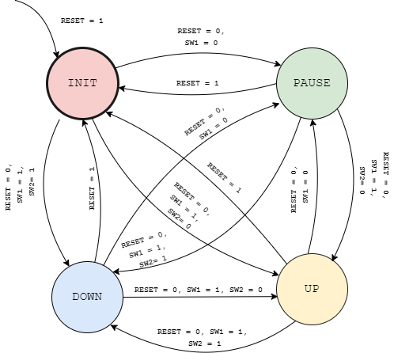
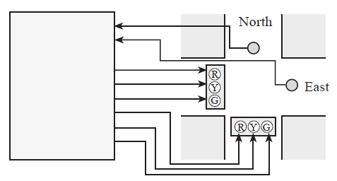

# Programación empleando maquinas de estados

## Sobre las maquinas de estados


Las **Maquinas de Estados Finitos (FSM)** permiten diseñar sistemas electronicos complejos mediante la descripción de estos por medio de unos elementos claves como:
* **Entradas**: Entradas asociadas a la maquina de estados.
* **Salidas**: Salidas asociadas a la maquina de estados.
* **Estados**: Estado de funcionamiento en el cual se encuentra la maquina de estados.
* **Transiciones**: Combinación de entradas que permiten que la maquina se mueva de un estado a otro.

Existen dos tipos de maquinas de estados, las maquinas **Mealy** y las maquinas **Moore**, sin embargo no ahondaremos en estas pues no esta dentro de los propositos de esta guia. Para representar una maquina de estados se usa una representación conocida como diagrama de estados. A continuación se muestra el diagrama de estados asociado a una maquina de estados tipo **Moore**:


## Estructuras de programación empleadas

En lo que respecta a la implementación, la estructura de codigo que se suele emplear para la implementación de una **FSM** es la estructura condicional ya sea empleando la estructura **if- else if - else** o la estructuda **switch**. A continuación recordemos la sintaxis de cada una de estas:


### Sintaxis if- else if - else

```C++
if (condition1) {
  // block of code to be executed if condition1 is true
} 
else if (condition2) {
  // block of code to be executed if the condition1 is false and condition2 is true
} 
else if (condition3) {
  // block of code to be executed if the condition1 and condition2 are false and condition3 is true
}
...
else {
  // block of code to be executed if all previus conditons are false
}
```

### Sintaxis switch

```C++
switch(expression) {
  case var1:
    // code block
    break;
  case var2:
    // code block
    break;
  default:
    // code block
}
```

## Implementación de una maquina de estados en codigo

Como punto de partida retomemos el diagrama de estados nuevamente:


Nuestro objetivo sera implementar el fragmento de codigo en C++ de este diagrama usando la estructura **switch** que es la mas común en una plantilla de un codigo arduino:

```ino
// Definicion de los estados
#define A 0
#define A 1
#define A 2

// Variable empleada para el estado actual
int state;

void setup() {
  // Codigo de inicializacion
  ...
  // Estado inicial de la FSM
  state = A;

}

void loop() {
  // ----- Logica del programa ----- //
  ...
  // ----- Codigo de la FSM ----- //
  switch(state) {
    case A:
      // Implementacion de la salidas de A: outputs(A)...
      ...
      // Transiciones desde el estado A
      if(inputs = inputs_A_B) {
         state = B;    
      }
      else if(inputs = inputs_A_C) {
         state = C;    
      }
      break;
    case B:
      // Implementacion de la salidas de B: outputs(B)...
      ...

      // Transiciones desde el estado A
      if(inputs = inputs_B_A) {
         state = A;    
      }
      else if(inputs = inputs_B_C) {
         state = C;    
      }
      break;
    case C:
      // Implementacion de la salidas de C: outputs(C)...
      ...
      // Transiciones desde el estado C
      if(inputs = condition_C_A) {
         state = A;    
      }
      else if(inputs = condition_C_B) {
         state = C;    
      }
      break;      
  }
  // Code...
  ...
}
```

## Metodologia basica empleada para definir una FSM

Antes de empezar a codificar el problema es necesario definir la maquina de estados asociada a este lo cual, para ello es bueno tener en cuenta los siguientes pasos:
1. Definir las entradas y su efecto en el sistema.
2. Definir las salidas y sus posibles valores.
3. Definir los estados en los cuales se tenga una clara asociación entre un conjunto de entradas y un conjunto de salidas deseados y de lo que se espera que haga el sistema en cada estado en cuestion.
4. Definir las transiciones entre los estados de tal manera que se conecten adecuadamente los estados de interes de acuerdo a los valores de la señal de entrada.
5. Dibujar el diagrama de estados.

## Ejemplos

Con el fin de aterrizar lo antes mencioado, vamos a realizar algunas implementaciones siguiendo esta metodologia.

### Ejemplo 1

Desarrollar un programa que imprima en el puerto serial el valor de un contador hasta 20 de tal manera que este cambie de acuerdo a las siguientes entradas:
* Cuando de presione el **pulsador** el contador se debera reiniciar a cero y detener el conteo.
* De acuerdo a los valores de los switches **1**, **2** y **3**, el comportamiento del sistema deberá ser el siguiente:
  * **switch 1**: En **ON** permite el incremento o disminución del contador, en **OFF** detiene el conteo.
  * **switches 2**: Si esta en **OFF** el contador se incrementa, si esta en **ON** el contador decrementa.

El circuito en el que se implementara este sistema se muestra a continuación:


**Solución**: Antes de empezar a codificar el programa vamos a tener en cuenta el siguiente planteamiento:

1. **Entradas**:
   
   |#|Entrada|Comportamiento esperado|
   |---|---|---|
   |1|```RESET```|Detiene y reinicia el contador cuando es colocada en ```HIGH```|
   |2|```SW1```|Si esta en ```HIGH``` permite que el contador cambie, si esta en ```LOW```, el contador permanecera en el mismo valor|
   |3|```SW2```|Si esta en ```LOW``` el contador se incrementa, si esta en ```HIGH```, el contador disminuye|

   En el programa el codigo asociado a estas entradas se muestra a continuación:

   ```ino
   // Entradas
   #define RESET 3
   #define SW1 9
   #define SW2 8
   ```

2. **Salidas**:
   
   |#|Salida|Valores|
   |---|---|---|
   |1|```cnt```| Variable que se imprime serialmente dentro del rango 0 - 19. Esta cambia de acuerdo al valor de las entradas definidas anteriormente|

   La variable asociada a la salida se muestra a continuación:

   ```ino
   // Variable para el contador
   int cnt = 0;
   ```

3. **Estados**:

   |#|Estado|Descripción|
   |---|---|---|
   |1|```INIT```|Estado inicial en el que el contador ```cnt = 0``` y al que se ingresa cuando se preciona el boton ```RESET```|
   |2|```PAUSE```|Estado que indica que el sistema tiene el contador ```cnt``` encuentra pausado|
   |3|```UP```| Estado el cual el contador se encuentra incrementandose ```cnt = cnt + 1```|
   |4|```DOWN```|Estado en el que el contador disminuye ```cnt = cnt - 1```|

   En este caso, las constantes asociadas a los estados se muestra a continuación:

   ```ino
   // Definicion de los estados
   #define INIT 1
   #define PAUSE 2
   #define UP 3
   #define DOWN 4
   ```

4. **Transiciones**:

   |Estado actual|Entradas|Siguiente estado|
   |---|---|---|
   |```INIT```|```RESET = 1```|```INIT```|
   |```INIT```|```RESET = 0```, ```SW1 = 0```|```PAUSE```|
   |```INIT```|```RESET = 0```, ```SW1 = 1```,```SW2 = 0```|```UP```|
   |```INIT```|```RESET = 0``` , ```SW1 = 1```,```SW2 = 1```|```DOWN```|
   |```PAUSE```|```SW1 = 1```,```SW2 = 0```|```UP```|
   |```PAUSE```|```SW1 = 1```,```SW2 = 1```|```DOWN```|
   |```PAUSE```|```RESET = 1```|```INIT```|
   |```DOWN```|```SW1 = 0```|```PAUSE```|
   |```DOWN```|```SW1 = 1, SW2 = 0```|```UP```|
   |```DOWN```|```RESET = 1```|```INIT```|
   |```UP```|```SW1 = 0```|```PAUSE```|
   |```UP```|```RESET = 1```|```INIT```|
   |```UP```|```SW1 = 1, SW2 = 1```|```DOWN```|

   Para poder realizar las transiciones, es necesario conocer el valor que toman las entradas y los estados asociados. Para esto se empleran las siguientes variables asociadas al estado actual y a los valores que tienen las entradas cuando son leidos:

   ```ino
   // Variable empleada para el estado actual
   int state;

   // Variables asociadas a las entradas
   int reset_value;
   int sw1_value;
   int sw2_value;
   ```

5. **Diagrama de estados**:

   A partir de la tabla de transición se construye el diagrama de estados el cual se muestra en la siguiente figura:

   

   Para mas claridad, observemos los fragmentos de codigo asociados a cada uno de los estados y sus transiciones:

   * **Estado INIT**: La parte de la tabla donde el estado actual es **INIT**, se muestra a continuación:
  
     |Estado actual|Entradas|Siguiente estado|
     |---|---|---|
     |```INIT```|```RESET = 1```|```INIT```|
     |```INIT```|```RESET = 0```, ```SW1 = 0```|```PAUSE```|
     |```INIT```|```RESET = 0```, ```SW1 = 1```,```SW2 = 0```|```UP```|
     |```INIT```|```RESET = 0``` , ```SW1 = 1```,```SW2 = 1```|```DOWN```|

     El fragmento de codigo asociado a este estado de muestra a continuación:

     ```ino
     case INIT:
       // Reinicio del contador
       cnt = 0;      

       // Transiciones desde el estado INIT      
       if(reset_value == LOW && sw1_value == LOW) {
          // INIT -> PAUSE
          state = PAUSE;    
       }
       else if(reset_value == LOW && sw1_value == HIGH && SW2 == LOW) {
          // INIT -> UP
          state = UP;    
       }
       else if(reset_value == LOW && sw1_value == HIGH && SW2 == HIGH) {
          // INIT -> DOWN
          state = DOWN;    
       }    
       break;
     ```

    * **Estado PAUSE**: La parte de la tabla donde el estado actual es **PAUSE**, se muestra a continuación:
  
     |Estado actual|Entradas|Siguiente estado|
     |---|---|---|
     |```PAUSE```|```SW1 = 1, SW2 = 0```|```UP```|
     |```PAUSE```|```SW1 = 1, SW2 = 1```|```DOWN```|
     |```PAUSE```|```RESET = 1```|```INIT```|

     El fragmento de codigo asociado a este estado de muestra a continuación:

     ```ino
     case PAUSE:
      // El contador queda pausado (No se hace nada)

      // Transiciones desde el estado PAUSE (Otra forma)   
      if(reset_value == HIGH) {
         // PAUSE -> INIT
         state = INIT;    
      }
      else {
        if(sw1_value == HIGH && sw2_value == LOW) {
         // PAUSE -> UP
         state = UP;    
        }
        else if(sw1_value == HIGH && sw2_value == HIGH) {
         // PAUSE -> DOWN
         state = DOWN;    
        }
      }
      break;
     ```

    * **Estado UP**: La parte de la tabla donde el estado actual es **UP**, se muestra a continuación:
  
     |Estado actual|Entradas|Siguiente estado|
     |---|---|---|
     |```UP```|```SW1 = 0```|```PAUSE```|
     |```UP```|```SW1 = 1, SW2 = 1```|```LOW```|
     |```UP```|```RESET = 1```|```INIT```|

     El fragmento de codigo asociado a este estado de muestra a continuación:

     ```ino
     case UP:
      // Incremento del contador
      cnt += 1; 
      // Transiciones desde el estado INIT      
      if(reset_value == HIGH) {
         // UP -> INIT
         state = INIT;    
      }
      else if(reset_value == LOW && sw1_value == LOW) {
         // UP -> PAUSE
         state = PAUSE;    
      }
      else if(reset_value == LOW && sw1_value == HIGH && sw2_value == HIGH) {
         //UP -> DOWN
         state = DOWN;    
      }    
      break;
     ```

    * **Estado DOWN**: La parte de la tabla donde el estado actual es **DOWN**, se muestra a continuación:
  
     |Estado actual|Entradas|Siguiente estado|
     |---|---|---|
     |```DOWN```|```SW1 = 0```|```PAUSE```|
     |```DOWN```|```SW1 = 1, SW2 = 0```|```UP```|
     |```DOWN```|```RESET = 1```|```INIT```|

     El fragmento de codigo asociado a este estado de muestra a continuación:

     ```ino
     case DOWN:
      // Incremento del contador
      cnt -= 1;
      // Transiciones desde el estado INIT      
      if(reset_value == HIGH) {
         // DOWN -> INIT
         state = INIT;    
      }
      else if(reset_value == LOW && sw1_value == LOW) {
         // DOWN -> PAUSE
         state = PAUSE;    
      }
      else if(reset_value == LOW && sw1_value == HIGH && sw2_value == LOW) {
         //DOWN -> UP
         state = UP;    
      }    
      break;
     ```

Finalmente el codigo de la implementación completa se muestra a continución ([simulación](https://www.tinkercad.com/things/fV5PeiHDENv)):

```ino
// Definicion de los estados
#define INIT 1
#define PAUSE 2
#define UP 3
#define DOWN 4

// Entradas
#define RESET 3
#define SW1 9
#define SW2 8

// Variable empleada para el estado actual
int state;

// Variables asociadas a las entradas
int reset_value;
int sw1_value;
int sw2_value;

// Variable para el contador
int cnt = 0;

// Codigo de inicializacion
void setup() {
  // Condiguracion de entradas y salidas
  pinMode(RESET, INPUT);
  pinMode(SW1, INPUT);
  pinMode(SW2, INPUT);
  // Configuracion puerto serial
  Serial.begin(9600);
    
  // Estado inicial de la FSM
  state = INIT;
  
}

// ciclo infinito
void loop() {
  // Lectura de las entradas
  reset_value = digitalRead(RESET);
  sw1_value = digitalRead(SW1);
  sw2_value = digitalRead(SW2);
  
  
  switch(state) {
    case INIT:
      // Reinicio del contador
      cnt = 0;      
      // Transiciones desde el estado INIT      
      if(reset_value == LOW && sw1_value == LOW) {
         // INIT -> PAUSE
         state = PAUSE;    
      }
      else if(reset_value == LOW && sw1_value == HIGH && SW2 == LOW) {
         // INIT -> UP
         state = UP;    
      }
      else if(reset_value == LOW && sw1_value == HIGH && SW2 == HIGH) {
         // INIT -> DOWN
         state = DOWN;    
      }    
      break;
    case PAUSE:
      // El contador queda pausado (No se hace nada)

      // Transiciones desde el estado PAUSE (Otra forma)   
      if(reset_value == HIGH) {
         // PAUSE -> INIT
         state = INIT;    
      }
      else {
        if(sw1_value == HIGH && sw2_value == LOW) {
         // PAUSE -> UP
         state = UP;    
        }
        else if(sw1_value == HIGH && sw2_value == HIGH) {
         // PAUSE -> DOWN
         state = DOWN;    
        }
      }
      break;
    case UP:
      // Incremento del contador
      cnt += 1; 
      // Transiciones desde el estado INIT      
      if(reset_value == HIGH) {
         // UP -> INIT
         state = INIT;    
      }
      else if(reset_value == LOW && sw1_value == LOW) {
         // UP -> PAUSE
         state = PAUSE;    
      }
      else if(reset_value == LOW && sw1_value == HIGH && sw2_value == HIGH) {
         //UP -> DOWN
         state = DOWN;    
      }    
      break;
    case DOWN:
      // Incremento del contador
      cnt -= 1;
      // Transiciones desde el estado INIT      
      if(reset_value == HIGH) {
         // DOWN -> INIT
         state = INIT;    
      }
      else if(reset_value == LOW && sw1_value == LOW) {
         // DOWN -> PAUSE
         state = PAUSE;    
      }
      else if(reset_value == LOW && sw1_value == HIGH && sw2_value == LOW) {
         //DOWN -> UP
         state = UP;    
      }    
      break;
  }
  delay(500);
  Serial.println(cnt);
  if(cnt > 19) {
    cnt = 0;
  }
  else if (cnt < 0) {
    cnt = 19;
  }
}
```

## Actividad de refuerzo

Una empresa le pide diseñar un controlador controlador de semáforo para controlar el trafico en una intersección entre dos caminos:



Al realizar el estudio uste propone una implemeción en Arduino empleando una Maquina de estados. Con el objetivo de maximizar el flujo de tráfico, minimizar el tiempo de espera en un semáforo en rojo y evitar accidentes usted propone un diseño el cual tiene contiene los siguientes elementos:
* Dos sensores de carros colocados en las carreteras **North** y **East**. Las salidas de los sensores se resumen en la siguiente tabla (Para simular estos use un dipswitch):

  |Salida|Descripción|
  |---|---|
  |00|Significa que no hay carros en ninguna de las carreteras|
  |01|Significa que hay carros en la carretera **East**|
  |10|Significa que hay carros en las carretera **North**|
  |11|Significa que hay carros ambas carreteras|

* Dos semaforos cuyas salidas dependen de los estados y debera tener en cuenta los siguientes criterios:
  * Cuando hay carros en una de las carreteras, el semaforo asociado a la via con carros debera estar en verde todo el tiempo.
  * Cuando hay carros en ambas carreteras, los semaforo cambiaran para controlar el trafico entre las vias. 
  * Cuando no hay carros en ninguna de las carreteras los semaforos permaneceran en amarillo indicando precaución. 


### Referencias

1. https://www.norwegiancreations.com/2017/03/state-machines-and-arduino-implementation/
2. https://my.eng.utah.edu/~cs5780/
3. https://majenko.co.uk/blog/our-blog-1/the-finite-state-machine-26
4. https://arekushi.github.io/Finite-State-Machine-Arduino/
5. https://arduining.com/2015/09/18/traffic-light-states-machine-with-arduino/
6. http://www.brunel.ac.uk/~emstaam/material/bit/Finite%20State%20Machine%20with%20Arduino%20Lab%203.pdf
7. https://openlab.citytech.cuny.edu/yestrella14-eportfolio/files/2012/08/Estrella_Yeraldina_CET4711_Lab6.pdf
8. https://cs.ou.edu/~fagg/classes/ame3623/lecture/class_fsm.pdf
