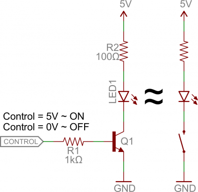
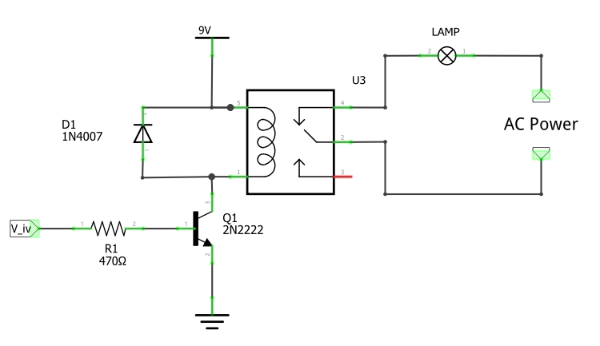

# Aplicaciones del transistor BJT como switch

El circuito base analizado en la teoria es el siguiente:

$$i_B=\frac{v_I - V_{BE}}{R_B}$$

$$i_C=\beta i_B$$

$$v_C=V_{CC} - R_C i_C$$

A lo largo de esta guia, lo que haremos sera ir cambiando la carga y analizando varios casos de aplicación del uso del transistor en corte y saturación tal y como lo muestra la siguiente figura tomada del siguiente [link](https://www.electronics-tutorials.ws/io/output-interfacing-circuits.html): 

## Led driver

Una aplicación bastante común de un transistor como switch es el **Driver para Leds**. En este, la carga es un led con su respectiva resistencia limitadora. 

En el **driver para led**, el control del encendido y apagado del led dependerá de transistor. La siguiente figura muestra un circuito típico en el cual se ilustra este escenario:

**Ejemplo**: Supongamos que se quiere controlar el encendido y apagado de un led rojo a traves de un arduino. Calcule los valores de diseño para las resistencias necesarios para que a traves del led circule una corriente de $10 mA$

El led rojo tiene una caida de voltaje aproximadamente de $V_{Led}=1.8V$, el valor de $R_2$ lo podemos elegir a gusto, de modo que si asumimos que $R_2 = 100 \Omega$. El brillo del led depende de la corriente a traves de este y en el problema nos dijeron que este iba a ser de $10 mA$. Luego tenemos los siguientes datos para arrancar:
* $V_{Led} = 1.8 V$
* $I_C = I_{Led} = 10 mA$
* $R_B = R_1 = ?$

Para calcular $R_B = R_1$ se asume que el diodo se encuentra en estado de saturación de modo que podemos suponer para los calculos que:
* $V_{BE} = 0.7 V$
* $V_{CE(sat)} = 0.2 V$
* $V_{CE(EOS)} = V_{CE(sat)} = 0.2 V$
* $V_{I} = V_{control} = 5 V$

Del circuito tenemos que $I_{C}$ en saturación tenemos que:

$$I_{C} = I_{C(sat)} = \frac{V_{CC} - (V_{Led}+V_{CE(sat)})}{R_C}$$

Luego, reemplazando los valores conocidos tenemos:

$$10m=\frac{5-(1.8+0.2)}{R_C}$$

$$R_C=\frac{3}{10m}$$

$$R_C= R_2 = 300\Omega$$

Por otro lado, del datasheet ([link](https://www.onsemi.com/pdf/datasheet/p2n2222a-d.pdf)) del 2N2222, $\beta_{min} = 75$ para $10 mA$, de modo que:

$$I_B(EOS)=\frac{I_C(sat)}{\beta_{min}} = \frac{10m}{75} \approx 0.13\ mA$$

Luego $I_B$ se obtiene fijando un factor de saturación $FS$ mediante la expresión:

$$I_B = FS*I_{B(EOS)}$$

Asumiento $FS = 10$, tenemos que:

$$I_B = FS*I_{B(EOS)} = 10 * 0.13m = 1.3\ mA$$

Ademas al ser $I_B$:

$$I_B = \frac{v_I - V_{BE}}{R_B} = \frac{V_{control}-V_{BE}}{R_1}$$

Si reemplazamos los valores conocidos tenemos que:

$$1.3m = \frac{5 - 0.7}{R_1}$$

$$R_B = \frac{5 - 0.7}{1.3m}$$

$$R_B = R_1 = 2.54\ k\Omega$$

Finalmente, tendremos que:

$$\beta_F = \frac{I_C}{I_B} = \frac{10}{1.3} = 7.69 $$

Luego, si todo esta bien, se debe cumplir que $\beta_F \leq \beta_{min}$ lo cual es valido para el caso:

$$\beta_F \leq \beta_{min} \longrightarrow 7.69 \leq 75 $$

Finalmente los valores $R1$ y $R2$ de diseño son:

|Resistencia|Teorico|Comercial|
|---|---|---|
|$R_1$|$2.54\ k\Omega$|$2.7\ k\Omega$|
|$R_2$|$300\ \Omega$|$330\ \Omega$|

Como los valores de las resistencias dieron un poco diferentes respecto al valor original, es necesario realizar nuevamente los calculos teoricos de $I_B$ e $I_C$ para estos nuevos valores:

$$I_B = \frac{v_I - V_{BE}}{R_B} = \frac{V_{control}-V_{BE}}{R_1} = \frac{5-0.7}{2.7k} \approx 1.59\ mA  $$

$$I_{C} = \frac{V_{CC} - (V_{Led}+V_{CE(sat)})}{R_C} = \frac{5-(1.8-0.2)}{330} \approx 9.1\ mA$$

Luego para estos nuevos valores.

$$\beta_F = \frac{I_C}{I_B} = \frac{9.1}{1.59} = 5.72$$

### Simulación

Para modelar el led vamos a usar el modelo que se da en el siguiente [link](https://github.com/kicad-spice-library/KiCad-Spice-Library/blob/master/Models/Diode/led.lib). Si montamos la simulación en LTSpice, esta queda como se muestra a continuación:

Si graficamos las señales de interes:

De las graficas, podemos concluir lo siguiente:
* El transistor esta operando en corte y saturación tal y como se espera. 
  * **Transistor ON**: $V_I = 5V \longrightarrow V_C \approx 0V $
  * **Transistor OFF**: $V_I = 0V \longrightarrow V_C \approx 5V $
* Vemos que el valor para corriente en el colector, varia un poco mas respecto al calculo teorico, esto tal vez por el modelo empleado para el led:
  
   |Variable|Teorico|Simulado|
   |---|---|---|
   |$I_B$|$1.59\ mA$|$1.6\ mA$|
   |$I_C$|$9.1\ mA$|$15\ mA$|

Adicionalmente se muestra tambien la simulación en Tinkercad ([link](https://www.tinkercad.com/things/blcFVhwrI0F)) para ver el comportamiento con los valores calculados para las resistencias:

* **Transistor ON**:
  
  

* **Transistor OFF**:
  
  

### Montaje real

Antes de realizar el montaje con el arduino, realizar el siguiente montaje con los valores calculados:

Como alimentación y tierra para el circuito, haga uso de los pineas **5V** y **GND** del arduino. Luego, empleando un multimetro realizar las siguientes mediciones y llenar las respectivas tablas:

* **Transistor ON**: $V_I = 5V$
  
  |Variable|Valor|
  |---|---|
  |$I_C$||
  |$I_B$||
  |$V_C$||
  |$V_{Led}$||

* **Transistor OFF**: $V_I = 0V$
  
  |Variable|Valor|
  |---|---|
  |$I_C$||
  |$I_B$||
  |$V_C$||
  |$V_{Led}$||

## Relay como carga

Un relé (en ingles, relay) es un switch electromecanico que se abre y cierra debido al campo electromagnetico generado por la corriente que pasa por la bobina que lo conforma. (La animación del funcionamiento se encuentra en el siguiente [link](https://docs.arduino.cc/tutorials/4-relays-shield/4-relay-shield-basics)).

El relay es usado principalmente para controlar el encendido y apagado de dispositivos que requieren altos niveles de voltajes o corrientes a traves de la aplicación señales de baja potencia desde dispositivos como los microcontroladores. 

El simbolo esquematico de un relay se muestra a continuación:

### Especificaciones de los relay

Los fabricantes de relés siempre suministran una hoja de datos (data sheet) con las especificaciones del relé. Esta hoja suele contenter los valores nominales de voltaje y corriente tanto para la bobina del relé como para sus contactos de conmutación. Tambien se suele incluir información sobre la ubicación de la bobina del relé y los terminales de contacto de conmutación. Dentro de las caracteristicas mas importantes descritas en la hoja de datose estan:
* **Pickup current**: Cantidad mínima de corriente a traves de la bobina necesaria para activación.
* **Holding current**: Cantidad mínima de corriente requerida para mantener el relé energizado.
* **Dropout voltage**: Voltaje máximo de la bobina en el que el relé ya no está energizado.
* **Contact voltage rating**: Voltaje máximo para el cual los contactos del relé son capaces de cambiar de manera segura.

Para entender mejor sobre lo anterior, se recomienda revisar el siguiente [link](https://programarfacil.com/blog/arduino-blog/rele-con-arduino-lampara/).

### Relay driver

En la pagina **Arduino Relay Control Circuit Designing and Code** ([link](https://www.electroniclinic.com/arduino-relay-control-circuit-designing-and-code/)) se describe claramente el procedimiendo para diseñar un driver para relee. Lo mas importante es conocer la corriente necesaria para energizar el relé lo cual se puede hacer midiendo (con un multimetro) la resistencia en la bobina y por medio de la aplicación de la ley de Ohm, conociendo el voltaje que se aplicara sobre la bobina, deducir la corriente asociada a esta, basicamente:

$$I_{Relay} = \frac{V-V_{CE(sat)}}{R}$$

A veces para hacer mas rapido el calculo se suele utilizar la expresión anterior sin tener en cuenta $V_{CE(sat)}$, así:

$$I_{Relay} = \frac{V}{R}$$

Como el Relay sera la carga que controlará el transistor, se deberá verificar que la $I_{C(max)} > I_{Relay}$ (es importante tener en cuenta, que la corriente del colector sea varias veces la corriente de la carga). 

**Ejemplo**: Diseñe un driver para Relé de forma que el transistor opere en la región de saturación, asuma que el relé tiene una resistencia interna de $50\ \Omega$ y que el voltaje de control es de 0 ó 5V. El circuito del driver se muestra a continuación:

Inicialmente tenemos que:

$$I_{Relay} = I_{C} = \frac{9}{50} = 180\ mA$$

Si miramos el datasheet del transistor NPN 2N2222 ([link](https://www.onsemi.com/pdf/datasheet/p2n2222a-d.pdf)) vemos que $I_{C(max)} = 600\ mA$ por lo que este transistor nos sirve. Luego tenemos que tomando $\beta_{min} = 40$:

La idea, es asegurarnos de que no se pida mas de $20\ mA$ de corriente de control por lo tanto si elegimos $10\ mA$

$$\beta_F = \frac{I_C}{I_B} = \frac{180m}{10m} = 18$$

Como se cumple que $\beta_F < \beta_{min}$ entonces podemos proceder con el calculo de la resistencia $R_B$, luego

$$I_B = \frac{v_I - V_{BE}}{R_B} = \frac{5-0.7}{R_B}$$

Si reemplazamos los valores conocidos tenemos que:

$$9m = \frac{5 - 0.7}{R_B}$$

$$R_B = \frac{5 - 0.7}{10m}$$

$$R_B = 430\Omega$$

Luego, el valor comercial para la resistencia de la base mas cercano es $R_B = 470 \Omega$. 

### Simulación

La simulación del circuito en LTSpice ([bjt_led-driver.asc](bjt_led-driver.asc)) se muestra a continuación:

Los resultados de la simulación se muestran en la siguiente grafica:

Ademas de la simulación anterior, tambien se muestra la simulación del driver en Tinkercad ([link](https://www.tinkercad.com/things/gGjs0A6k5D7)) cuyos resultados se muestran a continuación:

* **Transistor ON**:
  
  

* **Transistor OFF**:
  
  

En el driver anterior abra notado que se usa un diodo conocido como **diodo rueda libre** (en ingles, **Flywheel diode**). Consulte cual es su función.

### Montaje real

Antes de realizar el montaje con el arduino, realizar el siguiente montaje mostrado a continuación:

Y proceda a realizar las siguientes mediciones:

* **Transistor ON**: $V_I = 5V$
  
  |Variable|Valor|
  |---|---|
  |$I_C$||
  |$I_B$||
  |$V_C$||

* **Transistor OFF**: $V_I = 0V$
  
  |Variable|Valor|
  |---|---|
  |$I_C$||
  |$I_B$||
  |$V_C$||

### Motores y solenoides

Ademas de los relé (vistos anteriormente), existen otro tipo de cargas inductivas (hechas con una bobina de alambre) que no pueden ser controladas por dispositivos de baja potencia el arduino. Para poder controlar dispositivos de alta potencia, los dispositivos de baja potencia usan interfaces de acondicionamiento de señal conocidas como **drivers** siendo el transistor, un componente clave en la constricción de estos.

Una de las principales aplicaciónes de las cargas inductivas es la transformación de energia electrica en mecanica. Cuando un material magnetico (hierro por ejemplo) es rodeado por una bobina, se construye un electroimán. Cuando una corriente fluye a través de la bobina, se genera un fuerte campo magnético haciendo que el nucleo (material ferromagnetico) se convierta en un iman; por otro lado, cuando la corriente se detiene, el material deja de ser una iman. Existen varios tipos de electroimanes como:
* **Solenoide**: es un tipo de electroimán en el que el núcleo se desliza hacia adelante y hacia atrás dentro de la bobina. Se puede utilizar para crear movimiento lineal a partir de una corriente.
* **Motor**: es un tipo de electoiman en el que la disposición de las bobinas e imanes permanentes hace que se produzca movimiento rotatorio a partir de la corriente. Un motor esta compuesto principalmente de dos partes; la parte fija conocida como **estator** y la parte movil o **rotor**.

Existen diferentes tipos de motores (Para mas información puede consultar el siguiente [link](https://www.electronics-tutorials.ws/io/io_7.html)); sin embargo, en nuestro caso solo nos dedicaremos a analizar el **motor DC con escobillas** (Ver: **Conceptos básicos de los motores de CC con escobillas** [link](https://www.digikey.com/es/blog/basics-of-brushed-dc-motors)).

Para conocer sobre el diseño de un driver de motor se recomienda que profundice con detenimiento mirando los siguientes recursos:
* Getting Started with Arduino ([link](https://www3.ntu.edu.sg/home/ehchua/programming/arduino/Arduino.html))
* Motor DC con Arduino y driver L298N o L293D [link](https://programarfacil.com/electronica/motor-dc/))
* Driving Motors with Arduino ([link](https://learn.sparkfun.com/tutorials/driving-motors-with-arduino/wiring-up-the-circuit))
* Motors and Selecting the Right One ([link](https://learn.sparkfun.com/tutorials/motors-and-selecting-the-right-one))
* Types of Motors ([link](https://learn.adafruit.com/adafruit-motor-selection-guide))
* Measuring Motor Performance ([link](https://learn.adafruit.com/improve-brushed-dc-motor-performance/measuring-motor-performance))

**Ejemplo**: Se desea implementar el control de un motor DC mediante el arduino. El circuito a implementar se muestra a continuación:

El motor disponible es un pequeño motor DC de 6 V ([datasheet](https://www.adafruit.com/product/711)) cuyas principales caracteristicas se resumen a continuación:
* **Rango de operación**: 4.5 - 9 V
* **Voltaje nominal**: 6 V
* **Corriente de vacío**: 70 mA
* **Corriente con carga**: 250 mA
* **Velocidad sin carga**: 9100 ± 1800 rpm
* **Velocidad con carga**: 4500 ±1500 rpm
* **Corriente de parada**: 500 max.

¿Cual es el valor la resistencia $R_B$ para controlar el transistor de modo que este opere como switch?

**Solución**: Como punto de partida es necesario verificar las caracteristicas electricas maximas de los elementos involucrados:
* **Arduino UNO**: Si nos fijamos en el datasheet ([link](https://docs.arduino.cc/hardware/uno-rev3)), el arduino maneja una corriente DC por pin I/O de 20 mA de modo que de entrada, un motor no puede ser controlado directamente usando un pin I/O. Por otro lado, la corriente maxima para la salida de 5V es de 500 mA.
* **Transistor 2N2222**: Al revisar el [datasheet](https://www.onsemi.com/pdf/datasheet/p2n2222a-d.pdf) del transistor, vemos que:
  * **Corriente continua maxima en el colector**: 600 mA:
  * **Ganancia de corriente DC** $(\beta)$: $\beta_{min}@150\ mA = 50$, $\beta_{min}@500\ mA = 40$.
* **Motor DC**: La corriente con la que trabaja normalmente es la corriente con carga es de 250 mA.

Teniendo en cuenta esto podemos deducir lo siguiente:
1. Se puede usar la entrada de 5 V en este caso para del transistor para la alimentación del motor. Si embargo es util tener en cuenta el siguiente concejo tomado del siguiente [link](https://learn.adafruit.com/adafruit-arduino-lesson-13-dc-motors/breadboard-layout):
   
  
    > The small motors does not draw more than 250mA but if you have a different motor, it could easily draw 1000mA, more than a USB port can handle! If you aren't sure of a motor's current draw, power the Arduino from a wall adapter, not just USB

2. El transistor sirve pues su corriente maxima es superior a la corriente maxima del motor.

Con esto en cuenta podemos proceder a realizar los calculos teniendo en cuenta los siguientes datos para el estado de saturación:
* $I_{Load} = I_C = 250 mA$
* $V_{CE(sat)} = 0.2 V$
* $V_{BE} = 0.7 V$
* $v_{I} = V_{control} = 5 V$
* $V_{CC} = 5 V$

Inicialmente hallamos $I_B$ eligiendo un $\beta_F < \beta_{min}$, y teniendo en cuenta que $I_B < 20 mA$ supongamos que de 20:

$$ \beta_F = \frac{I_C}{I_B} = \frac{I_{Load}}{I_B}$$

$$ 20 = \frac{250\ m}{I_B}$$

$$ I_B = \frac{250\ m}{20} = 12.5 mA$$

Luego, calculamos $R_B$:

$$ I_B = \frac{v_I - V_{BE}}{R_B}$$

$$ R_B = \frac{v_I - V_{BE}}{I_B} = \frac{v_{control} - V_{BE}}{I_B} = \frac{5 - 0.7}{12.5m} $$

$$ R_B = 344 \Omega$$

El valor comercial mas cercano al valor teorico es $R_B = 330 \Omega$ lo cual hace que al recalcular la corriente para la base el valor sea:

$$ I_B = \frac{v_I - V_{BE}}{R_B} = \frac{4.3}{330} \approx 13 mA $$

Para simular, vamos a buscar por ley de Ohm la resistencia asociada a la carga (motor):

$$V_{load} = V_{motor} = v_C - V_{CE(sat)}$$

$$V_{motor} = 5 - 0.2 = 4.8V$$

$$ I_C = I_{Load} = \frac{V_{Load}}{R_C} = \frac{V_{Load}}{R_{Load}}$$

$$ R_{Load} = \frac{V_{Load}}{I_{Load}} = \frac{4.8}{250m} = 19.2 \Omega$$

De este modo tenemos el siguiente montaje en Spice ([bjt_motor-driver.asc](bjt_motor-driver.asc)) para llevar a cabo la simulación:

La graficas de las señales de interes se muestran a continuación:

Finalmente, vamos a proceder a observar la simulación en tinkercad ([link](https://www.tinkercad.com/things/0F2bS0WtlEr)) cuando el transistor esta saturado:

Despues de realizados los calculos anteriormente descritos, el montaje final será:

Y el montaje a realizar será:

### Montaje

Realizar el siguiente montaje en la protoboard:

Luego, empleando el multimetro realizar las siguientes mediciones y llenar las siguientes tablas:

* **Transistor ON**: $V_I = 5V$
  
  |Variable|Valor|
  |---|---|
  |$I_C$||
  |$I_B$||
  |$V_C$||

* **Transistor OFF**: $V_I = 0V$
  
  |Variable|Valor|
  |---|---|
  |$I_C$||
  |$I_B$||
  |$V_C$||

## Puente H

Un puente H es un circuito basado en transistores capaz de activar motores para que giren tanto en sentido horario como antihorario. Fundamentalmente, un puente H es una combinación de cuatro transistores con dos líneas de entrada (**INA** e **INB**) y dos salidas (**OUTA** y **OUTB**). La siguiente figura muestra un esquema general de un puente H:

Si amabas entradas tienen el mismo voltaje, las salidas al motor pondran el mismo voltaje y por lo tanto el motor no podra girar. Por otro lado, si las dos entradas son opuestas, el motor podra girar en cualquiera de las direcciones. La siguiente tabla describe el funcionamiento del puente H:

|Input A	|Input B	|Output A	|Output B|	Motor Direction|
|---|---|---|---|---|
|0	|0	|1	|1	|Stopped (braking)|
|0	|1	|1	|0	|Clockwise|
|1	|0	|0	|1	|Counter-clockwise|
|1	|1	|0	|0	|Stopped (braking)|

A continuación se muestra un circuito tipico (tomado del siguiente [link](https://learn.adafruit.com/transistors-101/example-uses)) en el cual se usan diodos rueda libre y resistencias de base para la polarizacion y proteccion de los transistores:

El montaje en protoboard de este se muestra a continuación:

### Actividad

Realice el montaje anterior y lleve a cabo las mediciones que se le soliciten en el laboratorio.

## Referencias

1. https://learn.adafruit.com/transistors-101
2. https://learn.sparkfun.com/tutorials/transistors/
3. https://learn.adafruit.com/adafruit-arduino-lesson-13-dc-motors
4. https://learn.sparkfun.com/tutorials/discrete-semiconductor-kit-identification-guide
5. https://learn.sparkfun.com/tutorials/driving-motors-with-arduino/introducing-the-transistor
6. https://learn.sparkfun.com/tutorials/sik-experiment-guide-for-the-arduino-101genuino-101-board/experiment-11-using-a-transistor
7. https://tourlomousis.pages.cba.mit.edu/fabclass-recitation-electronics/
8. https://craftofelectronics.org/todo/rotation/switching.html
9. https://www.robotroom.com/BipolarHBridge.html
10. https://docs.arduino.cc/tutorials/motor-shield-rev3/msr3-controlling-dc-motor
11. https://arduinogetstarted.com/tutorials/arduino-dc-motor
12. https://www.instructables.com/DC-Motor-Control-Arduino-Uno-R3/
13. https://www.robotique.tech/robotics/running-a-dc-motor-with-arduino-in-both-directions/
14. https://learn.adafruit.com/adafruit-arduino-lesson-13-dc-motors/overview
15. https://www.electronics-tutorials.ws/io/io_1.html
16. https://uk.rs-online.com/web/content/discovery/ideas-and-advice/dc-motors-guide
17. https://www3.ntu.edu.sg/home/ehchua/programming/arduino/Arduino.html#zz-7.
18. http://playwithrobots.com/dc-motor-driver-circuits/
19. https://www.electronics-tutorials.ws/io/io_7.html
20. https://www.seeedstudio.com/130-DC-Motor-p-2023.html
21. https://learn.adafruit.com/transistors-101/example-uses
22. https://learn.adafruit.com/adafruit-arduino-lesson-13-dc-motors
23. https://en.wikipedia.org/wiki/Brushed_DC_electric_motor
24. https://en.wikipedia.org/wiki/Electric_motor
25. http://lancet.mit.edu/motors/motors3.html
26. https://learn.sparkfun.com/tutorials/driving-motors-with-arduino/introducing-the-transistor
27. https://learn.sparkfun.com/tutorials/sik-experiment-guide-for-the-arduino-101genuino-101-board/experiment-11-using-a-transistor
28. https://learn.sparkfun.com/tutorials/transistors#applications-i-switches
29. https://craftofelectronics.org/todo/rotation/switching.html
30. https://www.iqsdirectory.com/articles/electric-motor/dc-motors.html
31. https://www.laboratoriogluon.com/motores-dc-y-arduino/
32. https://programarfacil.com/electronica/motor-dc/
33. https://randomnerdtutorials.com/arduino-control-dc-motor-via-bluetooth/
34. https://pygmalion.tech/tutoriales/electronica/motor-dc/
35. https://docs.arduino.cc/learn/electronics/transistor-motor-control
36. https://nationalmaglab.org/magnet-academy/watch-play/interactive-tutorials/dc-motor/
37. https://randomnerdtutorials.com/esp32-dc-motor-l298n-motor-driver-control-speed-direction/
38. https://learn.adafruit.com/adafruit-arduino-lesson-13-dc-motors/overview
39. https://learn.adafruit.com/adafruit-motor-shield-v2-for-arduino/using-dc-motors
40. https://www.adafruit.com/category/865
41. https://www.hackster.io/bobowman/12v-dc-motor-controlled-by-adafruit-tb6612-motor-driver-feec83
42. https://www.seeedstudio.com/130-DC-Motor-p-2023.html
43. https://www.integrasources.com/blog/dc-motor-controller-design-principles/
44. https://resources.pcb.cadence.com/blog/dc-motor-drive-circuit-design
45. https://www.ti.com/lit/ug/tiduaw3/tiduaw3.pdf?ts=1681740521210&ref_url=https%253A%252F%252Fwww.google.com%252F
46. https://hackernoon.com/building-a-brushed-dc-motor-controller-an-overview-ha3r3397
47. https://www.instructables.com/Build-Your-Own-Motor-Driver/
48. https://www.homemade-circuits.com/dc-motor-speed-controller-circuits/
49. https://www.st.com/content/ccc/resource/sales_and_marketing/presentation/application_presentation/group0/23/a1/94/a3/39/cf/4c/37/introduction_to_electric_motors_pres.pdf/files/introduction_to_electric_motors_pres.pdf/jcr:content/translations/en.introduction_to_electric_motors_pres.pdf
50. https://www.ti.com/lit/ml/sekp120/sekp120.pdf?ts=1681777546541&ref_url=https%253A%252F%252Fwww.google.com%252F
51. https://learn.sparkfun.com/tutorials/driving-motors-with-arduino/introducing-the-transistor
52. https://learn.sparkfun.com/tutorials/sik-experiment-guide-for-the-arduino-101genuino-101-board/experiment-11-using-a-transistor
53. https://learn.sparkfun.com/tutorials/transistors#applications-i-switches
54. https://randomnerdtutorials.com/guide-for-relay-module-with-arduino/
55. https://learn.sparkfun.com/tutorials/sik-experiment-guide-for-the-arduino-101genuino-101-board/experiment-11-using-a-transistor
56. https://learn.adafruit.com/adafruit-power-relay-featherwing/overview
57. https://blog.adafruit.com/2016/04/02/how-to-set-up-a-5v-relay-on-the-arduino-arduinod16/
58. https://learn.adafruit.com/adafruit-io-hub-with-the-adafruit-funhouse/relay-control-example
59. https://learn.sparkfun.com/tutorials/qwiic-single-relay-hookup-guide/all
60. https://cdn.sparkfun.com/assets/5/e/e/d/f/3V_Relay_Datasheet_en-g5le.pdf
61. https://learn.sparkfun.com/tutorials/sik-experiment-guide-for-arduino---v32/experiment-13-using-relays
62. https://www.electronics-tutorials.ws/blog/relay-switch-circuit.html
63. https://www3.ntu.edu.sg/home/ehchua/programming/arduino/Arduino.html
64. https://www.electronics-tutorials.ws/blog/relay-switch-circuit.html
65. https://my.eng.utah.edu/~cs5789/2009/slides/motors.pdf
66. https://my.eng.utah.edu/~cs5789/
67. https://my.eng.utah.edu/~cs5789/2009/slides/I2c.pdf
68. https://learn.adafruit.com/adafruit-motor-selection-guide