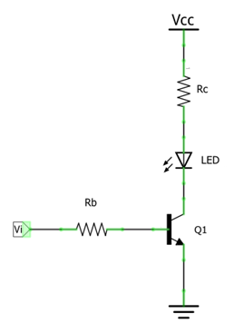
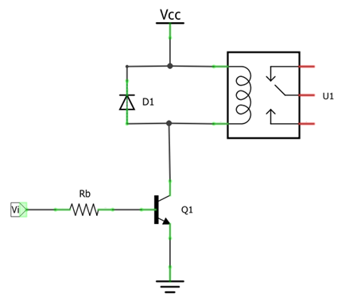
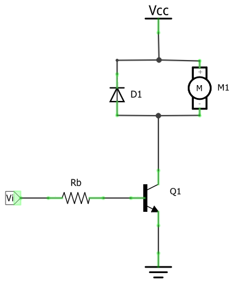
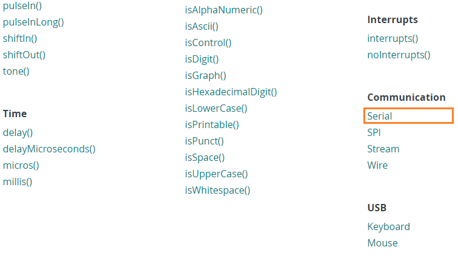
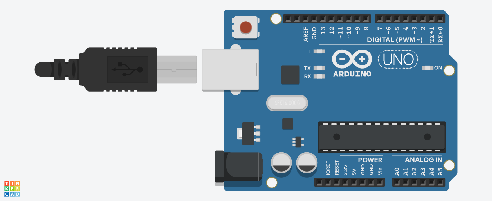
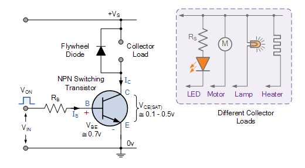
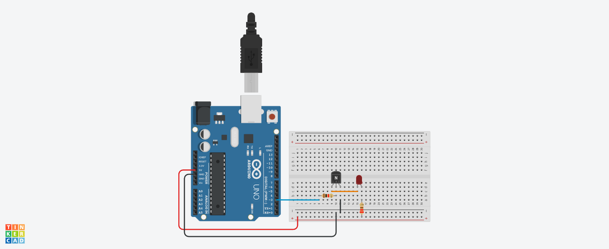
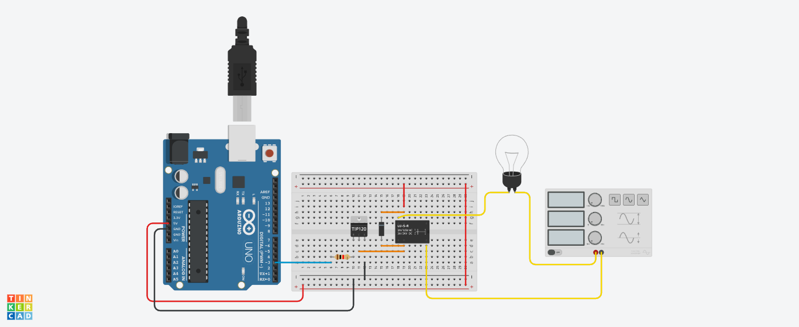
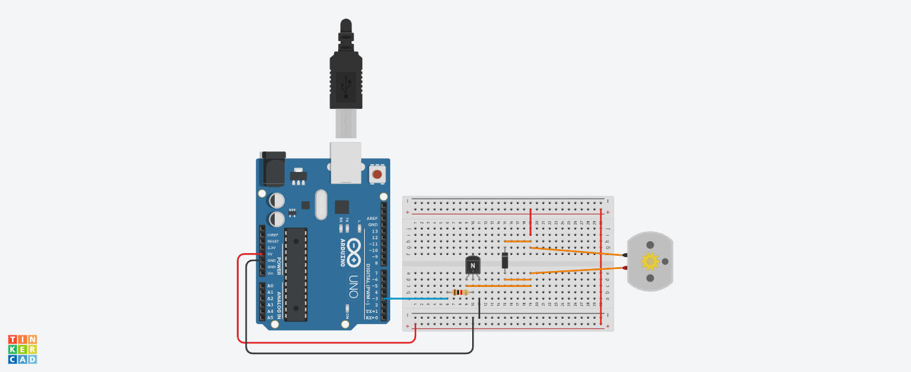

# Manejo del puerto serial

## Objetivos

> * Comunicar por medio de una interfaz serial el arduino con el PC.
> * Comprender las funciones de manejo de la interfaz serial del arduino.
> * Evidenciar mediante el estudio de algunos casos de aplicación, el uso de comunicación serial para el control de puertos en el arduino.

## Circuitos de interfaz

En el laboratorio anterior, vimos los siguientes circuitos de acondicionamiento (drivers) para conectar salidas digitales de baja potencia (pines del arduino), a cargas de altas potencias: Relés, motores, etc. 

### Driver para led



### Driver para relé



### Driver para motor DC



## Comunicación serial

Mediante la comunicación es posible que varios dispositivos puedan transferir y recibir información entre ellos. La informacion puede ser transferida de manera paralela o serial, en estas, la diferencia radica en la cantidad de datos que se transfieren simultaneamente (tal y como se muestra en la siguiente imagen tomada del siguiente [link](https://learn.adafruit.com/circuit-playground-express-serial-communications/overview)).


Existe una gran variedad de protocolos seriales que han ido emergiendo con el paso de los años, entre estos estan:
* USB (Universal Serial Bus).
* Ethernet.
* SPI (Serial Peripherical Interface).
* I2C (Inter-Integrated Circuit).

Para conocer mas sobre la comunicación serial, le sugerimos que de un vistazo en el tutorial **Serial Communication** de Sparkfun ([link](https://learn.sparkfun.com/tutorials/serial-communication/serial-intro)).

En el API de Arduino ([link](https://www.arduino.cc/reference/en/)) se encuentran las principales funciones, clases y estructuras de datos que se usan para hacer programas en Arduino. En el link [Serial](https://www.arduino.cc/reference/en/language/functions/communication/serial/) la sección **Communication** se acceden a la documentación de todas las funciones para establecer comunicación serial.



Por otro lado, en la pagina **Built-in Examples** ([link](https://docs.arduino.cc/built-in-examples/)). 

### Funciones serial

En el link [arduino programming notebook](http://engineering.nyu.edu/gk12/amps-cbri/pdf/ArduinoBooks/Arduino%20Programming%20Notebook.pdf) se encuentra una descripción muy completa de las principales funciones empleadas cuando se trabaja con arduino, sin embargo, en la siguiente tabla se hace un poco de enfasis en las que se usan comunmente en la comunicación serial. 

|Función|Descripción|
|---|---|
|```Serial.begin()```|Configura la velocidad de transmisión serial (bits por segundo = baud).<br><br>**Sintaxis**:<br>```Serial.begin(speed)``` <br><br>**Parámetros**: <ul><li>**```speed```**: Velocidad de transmisión</ul>|
|```Serial.print()```|Imprime los datos del puerto serial en formato ASCII.<br><br>**Sintaxis**:<br>```Serial.print(val)```<br>```Serial.print(val, format)```<br><br>**Parámetros**: <ul><li>**```val```**: Valor a imprimir. El valor puede ser de cualquier tipo.<li>**```format```**: Formato de representación del ASCII (```DEC```, ```HEX```, ```OCT``` o ```BIN```).</ul>|
|```Serial.available()```|Obtiene el número de bytes (caracteres) disponibles por leer en el puerto serial. Estos son datos que ya han llegado y han sido almacenados en el buffer de recepción serial (el cual almacena 64 bytes).<br><br>**Sintaxis**:<br>```Serial.available()```<br><br>**Valores retornados**: Número de bytes disponibles para leer.|
|```Serial.read()```|Lee un dato que entra a través del serial.<br><br>**Sintaxis**:<br>```Serial.read()```<br><br>**Valores retornados**: Primer byte de los datos seriales disponibles (o ```-1``` si no hay datos disponibles). El tipo de dato leído es ```int```.|

### Ejemplos

Los siguientes ejemplos se tomaron del capitulo cuatro ([link al capitulo](https://www.oreilly.com/library/view/arduino-cookbook/9781449399368/ch04.html)) del libro **Arduino Cookbook** cuyo repositorio se encuentra en el siguiente [link](https://github.com/bjepson/Arduino-Cookbook-3ed-INO). Para ejecutar estos no necesita emplear hardware adicional, solo basta el arduino conectado a una terminal serial.



Es importante anotar que la terminal serial que viene con el IDE de Arduino no es la unica opción; existen otras como: CuteCom, Bray Terminal, GNU Screen, moserial, PuTTY, RealTerm y ZTerm entre otros (Para mas información sobre como usar otras alternativas puede consultar el siguiente [link](https://learn.sparkfun.com/tutorials/terminal-basics)).

1. Hacer un programa que imprima numeros secuenciales en el monitor serial:
   *  **Código**: [ch04_SerialOutput.ino](https://github.com/bjepson/Arduino-Cookbook-3ed-INO/blob/master/ch04/ch04_SerialOutput/ch04_SerialOutput.ino)
   *  **Simulacion**: [link](https://www.tinkercad.com/things/ia9Zcp6sWCl)
2. Hacer un programa envie datos desde el arduino y los muestre en el monitor serial en diferentes formatos (texto, valores decimales, hexadecimales y binarios):
   *  **Código**: [ch04_SerialFormatting.ino](https://github.com/bjepson/Arduino-Cookbook-3ed-INO/blob/master/ch04/ch04_SerialFormatting/ch04_SerialFormatting.ino)
   *  **Simulacion**: [link](https://www.tinkercad.com/things/fZ1gTxVtLnF)
3. Hacer un programa en el cual el Arduino reciba datos (comandos) desde un computador u otro dispositivo. En este caso, el dato recibido por el Arduino será un caracter numerico (desde el 0 al 9) y cuando sea recibido, el arduino tiene que poner a parpadear el led integrado de la tarjeta a una tasa proporcional al valor del digito recibido. Por ejemplo, si el arduino recibe el 3, entonces la tasa de parpadeo sera de 3*100 = 300 ms:
   *  **Código**: [ch04_SerialReceive.ino](https://github.com/bjepson/Arduino-Cookbook-3ed-INO/blob/master/ch04/ch04_SerialReceive/ch04_SerialReceive.ino)
   *  **Simulacion**: [link](https://www.tinkercad.com/things/imfTSK2zyyV)
4. Hacer un programa en el cual el Arduino reciba datos (comandos) desde un computador u otro dispositivo. En este caso, el dato recibido por el Arduino será un caracter numerico (desde el 0 al 9) y cuando sea recibido, el arduino tiene que poner a parpadear el led integrado de la tarjeta a una tasa proporcional al valor del digito recibido. Por ejemplo, si el arduino recibe el 3, entonces la tasa de parpadeo sera de 3*100 = 300 ms:
   *  **Código**: [ch04_SerialReceive.ino](https://github.com/bjepson/Arduino-Cookbook-3ed-INO/blob/master/ch04/ch04_SerialReceive/ch04_SerialReceive.ino)
   *  **Simulacion**: [link](https://www.tinkercad.com/things/imfTSK2zyyV)
5. Hacer el mismo programa del ejemplo 3, pero en este caso use la función ```Serial.parseInt()``` para convertir el caracter a entero. 
   *  **Código**: [ch04_SerialParsing.ino](https://github.com/bjepson/Arduino-Cookbook-3ed-INO/blob/master/ch04/ch04_SerialParsing/ch04_SerialParsing.ino)
   *  **Simulacion**: [link](https://www.tinkercad.com/things/i570IXbxv4L)
6. Hacer un programa que funcione haga lo mismo que el ejemplo 3 pero que en este caso implemente la función ```serialEvent()``` la parte de la conversión y calculo del retardo para el parpadeo.
   *  **Código**: [ch04_SerialEventReceive.ino](https://github.com/bjepson/Arduino-Cookbook-3ed-INO/blob/master/ch04/ch04_SerialEventReceive/ch04_SerialEventReceive.ino)
   *  **Simulacion**: [link](https://www.tinkercad.com/things/6yJnQdtKKbq)
7. Hacer un programa que permite cambiar la tasa de parpadeo de un bit al recibir via serial una cadena de caracteres numericos cuya terminación se indique con un caracter no numerico al final. Por ejemplo, si el usuario envia la cadena 750f, el led debera parpadear a una tasa de 750ms. Como restricción, el numero maximo a enviar solo puede tener cinco caracteres numericos:
   *  **Código**: [ch04_atoi.ino](https://github.com/bjepson/Arduino-Cookbook-3ed-INO/blob/master/ch04/ch04_atoi/ch04_atoi.ino)
   *  **Simulacion**: [link](https://www.tinkercad.com/things/eZRqCQ8bmlg)
8. Existen casos en los cuales se desea el envio de mensajes con mas de un campo de información por mensaje. Un ejemplo tipico es el caso en el cual el mensaje contiene valores de dos o mas sensores y este mensaje sera enviado a una aplicación en otro dispositivo para que los datos sean tradados. Para entender este escenario, el siguiente programa envia repetidamente el mensaje ```H,10,100,1000\r\n``` via puerto serial.
   *  **Código**: [ch04_CommaDelimitedOutput.ino](https://github.com/bjepson/Arduino-Cookbook-3ed-INO/blob/master/ch04/ch04_CommaDelimitedOutput/ch04_CommaDelimitedOutput.ino)
   *  **Simulacion**: [link](https://www.tinkercad.com/things/gyKfNnouCty)
9.  En este caso de uso, se muestra una aplicación en la cual se recibe un mensaje que contiene mas de un campo. Por ejemplo, si el mensaje contiene un identificador para indicar un dispositivo particular (como un motor u otro actuador) y un valor (tal como la velocidad). En este caso, se muestra un ejemplo en el cual el arduino recibe un mensaje como el mostrado a continuación ```H,10,100,1000\r\n```. En este mensaje el formato empieza con el caracter **H**, seguido por tres valores numericos separados por coma para terminar con el caracter **new line** (```'\r\n'```):
   *  **Código**: [ch04_SerialReceiveMultipleFields.ino](https://github.com/bjepson/Arduino-Cookbook-3ed-INO/blob/master/ch04/ch04_SerialReceiveMultipleFields/ch04_SerialReceiveMultipleFields.ino)
   *  **Simulacion**: [link](https://www.tinkercad.com/things/5gQsq6sDRon)

## Trabajo del laboratorio

### Elementos necesarios

|Item|Componente|Cantidad|
|---|---|---|
|1|Arduino UNO|1|
|2|Cable USB|1|
|3|Diodo 1N4004|4|
|4|Relé 5V|1|
|5|Motor DC de 6 V|1|
|6|Led Rojo|2|
|7|Led Verde|2|
|8|Led Amarillo|2|
|9|Resistencia de 330Ω|6|
|10|Resistencia de 1kΩ|4|
|11|Transistores NPN (2N2222 o similar)|2|
|12|Transistores PNP (2N2907 o similar)|2|
|13|Transistores TIP 120|2|
|14|Plafon con bombillo y conexiones|1|
|15|Cables tipo caimán|4|
|16|Cables de protoboard|---|

### Montaje 1

Controlar mediante un comando el encendido y apagado de una carga. El circuito generico para esta prueba se muestra a continuación:



El objetivo para el caso es probar con el mismo driver y diferentes cargas eligiendo como resistencia de base $R_B = 1k\Omega$ y probando el mismo circuito para tres cargas distintas:
* Un led
* Un Relé
* Un motor DC

**Software**

El programa es el mismo para todos los casos y consisten en un programa en el cual el Arduino recibe desde una aplicación en un PC (monitor serial o similar) un comando 


```ino
#define ON HIGH
#define OFF LOW

const int motorPin = 3;    // Motor transistor 

int status = 0; 

void setup() {
  pinMode(motorPin, OUTPUT);
  Serial.begin(9600);
  while (!Serial);
  Serial.println("**********************");
  Serial.println("Control ON/OFF: ");
  Serial.println("- ON: 1");
  Serial.println("- OFF: 0");
  Serial.println("**********************");
}

void loop() {
  if(Serial.available() > 0) {
    // read the incoming byte
    status = Serial.read();
    Serial.print("Received: ");
    Serial.print(status - '0');
    if(status == '1') {
      digitalWrite(motorPin, ON);    
      Serial.println(" -> Carga ON");
    }
    else if (status == '0') {
      digitalWrite(motorPin, OFF);    
      Serial.println(" -> Carga OFF");
    }
    Serial.println();
  }
}
```

**Control del encendido y apagado de un LED**

Descargue el código anterior en el arduino, monte el siguiente circuito y verifique el funcionamiendo de este ([simulacion](https://www.tinkercad.com/things/edk45NDmNIK)):



Luego de que comprenda el funcionamiento de este, llene la siguiente tabla:

* Caso en el cual el LED esta apagado:
  
  |Medida|Valor|
  |---|---|
  |$V_{I}$|$0V$|
  |$I_{B}$||
  |$I_{C}$||
  |$V_{BE}$||
  |$V_{CE}$||

* Caso en el cual el LED esta encendido:

  |Medida|Valor|
  |---|---|
  |$V_{I}$|$5V$|
  |$I_{B}$||
  |$I_{C}$||
  |$V_{BE}$||
  |$V_{CE}$||

**Control del encendido y apagado de un bombillo**

Ahora, coloque como carga un relee como carga tal y como se muestra en la siguiente figura (tenga en cuenta que en vez de el generador de funciones lo que se empleará la señal de 110 AC que sale del toma corriente). Antes de hacer el montaje estudie el funcionamiento de este circuito en la siguiente simulación ([link](https://www.tinkercad.com/things/fHiXJuvcqLJ)):


Despues de que entienda el funcionamiento realizar las siguientes medidas:

* Caso en el cual el LED esta apagado:
  
  |Medida|Valor|
  |---|---|
  |$V_{I}$|$0V$|
  |$I_{B}$||
  |$I_{C}$||
  |$V_{BE}$||
  |$V_{CE}$||

* Caso en el cual el LED esta encendido:

  |Medida|Valor|
  |---|---|
  |$V_{I}$|$5V$|
  |$I_{B}$||
  |$I_{C}$||
  |$V_{BE}$||
  |$V_{CE}$||

Luego, reemplace el transistor **2N2222** por un transistor **TIP120** tal y como se muestra en la siguiente figura ([simulación](https://www.tinkercad.com/things/kRmm8pHraoA)):



Luego, proceda a realizar las mismas mediciones llenando la siguiente tabla:

* Caso en el cual el LED esta apagado:
  
  |Medida|Valor|
  |---|---|
  |$V_{I}$|$0V$|
  |$I_{B}$||
  |$I_{C}$||
  |$V_{BE}$||
  |$V_{CE}$||

* Caso en el cual el LED esta encendido:

  |Medida|Valor|
  |---|---|
  |$V_{I}$|$5V$|
  |$I_{B}$||
  |$I_{C}$||
  |$V_{BE}$||
  |$V_{CE}$||

**Control del encendido y apagado de un motor DC**

Ahora, use como carga un motor DC tal y como se muestra en la siguiente figura ([simulación](https://www.tinkercad.com/things/1pC3LhT7evG)):



Realice la simulación y comprenda el funcionamiento.

### Montaje 2

En el circuito de control del motor DC (anteriormente analizado):


Cambie el programa que se ejecuta en el Arduino con el siguiente código (antes de realizar esto se recomienda que analice la siguiente [simulación](https://www.tinkercad.com/things/f5AJFc4PiGB)):

```ino
const int motorPin = 3;    // Motor transistor 
int speed = 0;             // Speed value 

void setup() {
  pinMode(motorPin, OUTPUT);
  Serial.begin(9600);
  while (!Serial);
  Serial.println("Speed 0 to 255");
}

void loop() {
  if(Serial.available() > 0) {
    speed = Serial.parseInt();
    if (speed >= 0 && speed <= 255) {
      analogWrite(motorPin, speed);
      Serial.println(speed);
    }
  }  
}
```

Una vez que realice el montaje entienda lo que hace el programa (recuerde el **ejemplo 5**). 

### Montaje 3

Un motor puede girar en dos sentidos, sin embargo, en los circuitos anteriormente analizados lo maximo que se logro fue cambiar la velocidad de giro del motor (**montaje 2**). 

Para poder cambiar el sentido de giro de un motor, es necesario invertir el sentido de la corriente que pasa a traves de este y es aqui donde entra el **Puente H** (Para mas información puede consultar el siguiente [link](https://www.modularcircuits.com/blog/articles/h-bridge-secrets/h-bridges-the-basics/))


Luego https://www.tinkercad.com/things/lsSNY3pfsXN:


## Tarea

Realizar el siguiente montaje y entender lo que hace [Arduino Lesson 15. DC Motor Reversing](https://learn.adafruit.com/adafruit-arduino-lesson-15-dc-motor-reversing)


## Referencias

1. http://psercacademy.asu.edu/index.php/pages/simulations
2. http://www.ermicro.com/blog/?p=423
3. https://www.circuitbasics.com/how-to-control-dc-motor-speed-using-tip120-on-arduino/
4. https://itp.nyu.edu/physcomp/labs/motors-and-transistors/dc-motor-control-using-an-h-bridge/
5. https://www.halvorsen.blog/documents/technology/iot/arduino.php
6. https://www.bogotobogo.com/index.php
7. https://developer.chrome.com/articles/usb/
8. https://learn.sparkfun.com/tutorials/connecting-arduino-to-processing/all
9. https://www.oreilly.com/library/view/arduino-cookbook/9781449399368/ch04.html
10. https://forum.arduino.cc/t/serial-input-basics-updated/382007
11. https://www.ladyada.net/learn/arduino/lesson4.html
12. https://deepbluembedded.com/esp32-hello-world-serial-print-arduino/
13. https://learn.adafruit.com/using-webusb-with-arduino-and-tinyusb/serial-communications-example
14. https://qxf2.com/blog/arduino-tutorials-for-testers-serial-monitor/
15. https://riptutorial.com/arduino/topic/1674/serial-communication
16. https://www.halvorsen.blog/documents/technology/iot/arduino/resources/Serial%20Communication%20between%20Arduino%20and%20LabVIEW.pdf
17. https://ww2.mathworks.cn/help/supportpkg/arduino/ref/send-and-receive-serial-data-using-arduino-hardware.html
18. https://startingelectronics.org/beginners/start-electronics-now/tut9-using-the-arduino-serial-port/
19. https://assiss.github.io/arduino-zhcn/cn/Tutorial/SoftwareSerialExample.html
20. https://arduinobot.pbworks.com/f/Manual+Programacion+Arduino.pdf
21. https://learn.sparkfun.com/tutorials/terminal-basics/all
22. https://learn.sparkfun.com/tutorials/serial-communication/wiring-and-hardware
23. https://learn.sparkfun.com/tutorials/serial-communication/res
24. https://learn.sparkfun.com/tutorials/serial-communication/uarts
25. https://learn.adafruit.com/circuit-playground-express-serial-communications/what-is-serial-communications
26. https://learn.sparkfun.com/tutorials/connecting-arduino-to-processing/to-processing
27. https://learn.sparkfun.com/tutorials/connecting-arduino-to-processing/to-processing
28. https://learn.sparkfun.com/tutorials/serial-basic-hookup-guide/all
29. https://learn.sparkfun.com/tutorials/serial-communication/all
30. https://learn.sparkfun.com/tutorials/terminal-basics/arduino-serial-monitor-windows-mac-linux
30. https://learn.adafruit.com/adafruit-arduino-lesson-5-the-serial-monitor/overview
31. https://www.bolanosdj.com.ar/MOVIL/ARDUINO2/ComuniSerialArduino.pdf
32. https://www.bolanosdj.com.ar/MOVIL/ARDUINO2/EjercicioDisplay7Continu.pdf
33. https://www.jgvaldemora.org/blog/tecnologia/wp-content/uploads/2016/10/PR%C3%81CTICAS-ARDUINO-20.pdf
34. https://www.paulrosero-montalvo.com/gallery/secap3.1.pdf
35. https://candy-ho.com/Drivers/librodeproyectosdearduinostarterkit-151212174250.pdf
36. https://idus.us.es/bitstream/handle/11441/101408/TFG-2873-PACHECO%20MARTINEZ.pdf?sequence=1&isAllowed=y
37. http://proyecto987.es/blog/wp-content/uploads/2016/04/Arduino-LabVIEW.pdf
38. https://repository.udistrital.edu.co/bitstream/handle/11349/13449/S%C3%A1nchezHuertasJulietteXimena2018.pdf?sequence=1&isAllowed=y
39. https://repository.unad.edu.co/bitstream/handle/10596/13295/1010023130.pdf?sequence=3&isAllowed=y
40. http://www.brunel.ac.uk/~emstaam/material/bit/Finite%20State%20Machine%20with%20Arduino%20Lab%203.pdf
41. https://upcommons.upc.edu/bitstream/handle/2117/87879/memoria.pdf?sequence=1&isAllowed=y
42. https://smartsys.web.unc.edu/wp-content/uploads/sites/16132/2018/09/lab2-thermistor-buzzer-serial-PWM.pdf
43. https://addi.ehu.es/bitstream/handle/10810/29158/TFG_BerthaLorenzoOchoa.pdf?se
44. https://ss-valpovo.hr/wp-content/uploads/2020/01/arduinoprojecthandbook.pdf
45. https://ecs-pw-facweb.ecs.csus.edu/~dahlquid/eee174/S2016/handouts/Labs/ArduinoLab/ArduinoInfo/
46. https://brown-cs1600.github.io/
47. https://serial-dashboard.github.io/index.html
48. https://github.com/bjepson/Arduino-Cookbook-3ed-INO
49. https://github.com/chillibasket/processing-grapher
50. https://wired.chillibasket.com/processing-grapher/
51. https://arduinobot.pbworks.com/f/Manual+Programacion+Arduino.pdf
