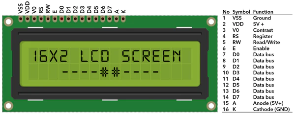
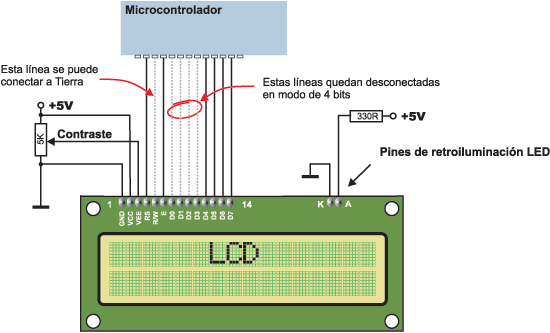
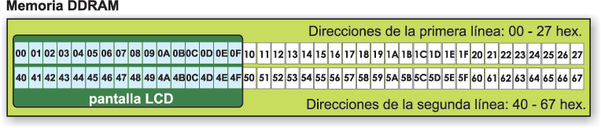
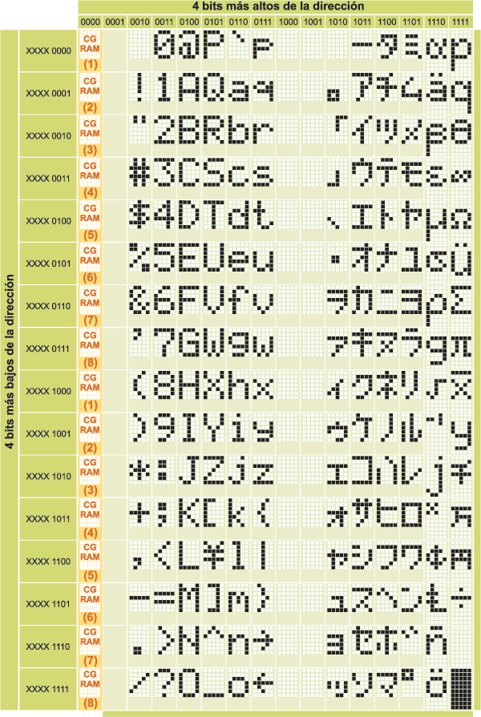
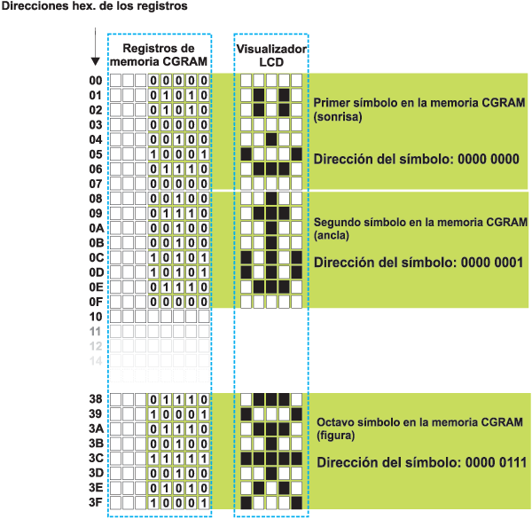
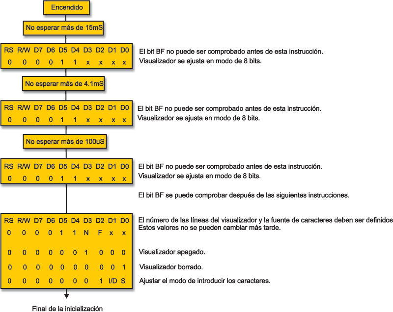
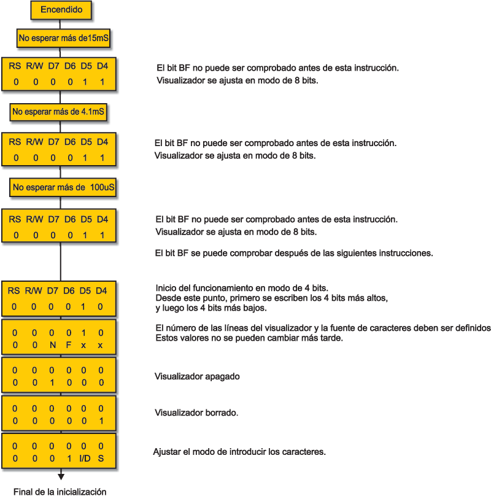

# Manejo del LCD

## Objetivos

> * Objetivo 1.
> * Objetivo 2.
> * Objetivo 3.

## Antes de empezar

Referencias principales:

https://www.mikroe.com/ebooks/microcontroladores-pic-programacion-en-basic/componentes-adicionales


## Sobre los displays LCD


https://robosans.com/learn/embedded/arduino/16x2-lcd-interfacing-with-arduino/


https://naylampmechatronics.com/blog/34_tutorial-lcd-conectando-tu-arduino-a-un-lcd1602-y-lcd2004.html

-----

### Pines y conexión

La siguiente figura muestra un LCD 16x2 con sus respectivos pines de interfaz:



La descripción de cada uno de los pines se muestra en la siguiente tabla:

|Función|Pin|Nombre|Estado Lógico|Descripción|
|---|---|---|:---:|---|
|Tierra (**GND**)|1|**VSS**|-|0V|
|Alimentación|2|**VDD**|-|+5V|
|Contraste|3|**VEE** o **V0**|-|0 - VDD|
|Control de funcionamiento|4|**RS**|0/1|<ul><li>**RS=0**: D0 – D7 considerados como comandos<li>**RS=1**: D0 – D7 considerados como datos</ul>|
|Control de funcionamiento|5|**R/W**|0/1|<ul><li>**RS=0**: Escribir los datos (del microcontrolador al LCD)<li>**RS=1**: Leer los daots (del LCD al microcontrolador)</ul>|
|Control de funcionamiento|6|**E**|Transición de 0 a 1|<ul><li>**E=0**: Acceso al visualizador LCd deshabilitado<li>**E=1**: Funcionamiento normal Datos/comandos se están transmitiendo al LCD</ul>|
|Datos / Comandos|7|**D0**|0 / 1|Bit 0 LSB|
|Datos / Comandos|8|**D1**|0 / 1|Bit 1|
|Datos / Comandos|9|**D2**|0 / 1|Bit 2|
|Datos / Comandos|10|**D3**|0 / 1|Bit 3|
|Datos / Comandos|11|**D4**|0 / 1|Bit 4|
|Datos / Comandos|12|**D5**|0 / 1|Bit 5|
|Datos / Comandos|13|**D6**|0 / 1|Bit 6|
|Datos / Comandos|14|**D7**|0 / 1|Bit 7 MSB|
|Alimentación positiva del backlight|15|**K**|-|0V|
|Alimentación negativa del backlight|16|**A**|-|+5V|

La siguiente figura muestra la forma conexión tipica entre un LCD y un microcontrolador:



Tal y como se resalta en la figura, es posible usar o no todas las lineas de datos del LCD y de esto depende el tipo de conexión la cual puede ser:
* **Conexión a 4 lineas**: Los bits de datos menos significativos (**D0-D3**) no se conectan.
* **Conexión a 8 lineas**: Se conectan todos los pines asociados a los bits de datos.

Los display LCD que normalmente se suelen usar, emplean el controlador **Hitachi HD44780**. El datasheet del controlador Hitachi HD44780 ([link](https://www.sparkfun.com/datasheets/LCD/HD44780.pdf)) contiene toda la información sobre la estructura, comunicación y control del LCD y por lo tanto, es una guia obligada cuando se desea diseñar un driver desde cero. El estudio de esta información se sale de los objetivos de esta guia (y hasta nos da tres vueltas) de modo que no se tratara en detalle. Sin embargo es util hablar de algunos aspectos basicos del controlador Hitachi.

### Memoria del controlador Hitachi HD44780

El controlador Hitachi HD44780 tiene tres localizaciones de memoria principales:
* **DDRAM (Data Display Random Access Memory)**: La memoria DDRAM se utiliza para almacenar los caracteres a visualizar. Tiene una capacidad de almacenar 80 caracteres.
  
  

* **CGROM (Character Generation Read Only Memory)**: Esta memoria contiene un mapa estándar de todos los caracteres que se pueden visualizar en la pantalla. A cada carácter se le asigna lugar de memoria, las direcciones de cada uno de los caracteres son los numeros de cada uno de los caracteres ASCCI ([tabla ASCII](https://www.asciitable.com/)):
  
  

* **CGRAM (Character Generation Random Access Memory)**: En esta región de 64 bytes se almacenan los caracteres definidos por el usuario (personalizados). El usario puede definir hasta 8 caracteres de 5x8 pixeles. Para esto, se utiliza los 5 bits mas bajos de cada registro (de 8 bits) para definir los puntos oscuros (1) de cada fila que conforma el caracter el cual, agrupa un total de ocho filas (registros).
  
  

### Comandos básicos

Todos los datos transmitidos a un display LCD por las salidas D0-D7 serán interpretados como un comando o un dato dependiendo del estado logico de pin **RS**:
* **RS = 1**: Los bits D0 - D7 son direcciones de los caracteres a visualizar. En este caso, el controlado del LCD direcciona un carácter seleccionado y lo visualiza en la dirección especificada en la DDRAM la cual se define antes de transmitir el carácter, o en caso contrario se toma con base en la dirección del carácter anteriormente transmitido la cual se aumenta automaticamente.
* **RS = 0**: Los bits D0 - D7 son empleados como comandos para ajustar el modo del visualización.

La siguiente tabla muestra una linea de comandos para el LCD:

<table>
    <thead>
        <tr>
            <th>Comando</th>
            <th>RS</th>
            <th>RW</th>
            <th>D7</th>
            <th>D6</th>
            <th>D5</th>
            <th>D4</th>
            <th>D3</th>
            <th>D2</th>
            <th>D1</th>
            <th>D0</th>
        </tr>
    </thead>
    <tbody>
        <tr>
            <td>Borrar el visualizador</td>
            <td>0</td>
            <td>0</td>
            <td>0</td>
            <td>0</td>
            <td>0</td>
            <td>0</td>
            <td>0</td>
            <td>0</td>
            <td>0</td>
            <td>1</td>
        </tr>
        <tr>
            <td>Poner el cursor al inicio</td>
            <td>0</td>
            <td>0</td>
            <td>0</td>
            <td>0</td>
            <td>0</td>
            <td>0</td>
            <td>0</td>
            <td>0</td>
            <td>1</td>
            <td>x</td>
        </tr>
        <tr>
            <td>Modo de entrada</td>
            <td>0</td>
            <td>0</td>
            <td>0</td>
            <td>0</td>
            <td>0</td>
            <td>0</td>
            <td>0</td>
            <td>1</td>
            <td>I/D</td>
            <td>S</td>
        </tr>
        <tr>
            <td>Activar/desactivar el visualizador</td>
            <td>0</td>
            <td>0</td>
            <td>0</td>
            <td>0</td>
            <td>0</td>
            <td>0</td>
            <td>1</td>
            <td>D</td>
            <td>U</td>
            <td>B</td>
        </tr>
        <tr>
            <td>Desplazar el cursor/visualizador</td>
            <td>0</td>
            <td>0</td>
            <td>0</td>
            <td>0</td>
            <td>0</td>
            <td>1</td>
            <td>D/C</td>
            <td>R/L</td>
            <td>x</td>
            <td>x</td>
        </tr>
        <tr>
            <td>Modo de funcionamiento</td>
            <td>0</td>
            <td>0</td>
            <td>0</td>
            <td>0</td>
            <td>1</td>
            <td>DL</td>
            <td>N</td>
            <td>F</td>
            <td>x</td>
            <td>x</td>
        </tr>
        <tr>
            <td>Establecer la dirección CGRAM</td>
            <td>0</td>
            <td>0</td>
            <td>0</td>
            <td>1</td>
            <td colspan=7>Dirección CGRAM</td>
        </tr>
        <tr>
            <td>Establecer la dirección DDRAM</td>
            <td>0</td>
            <td>0</td>
            <td>1</td>
            <td colspan=8>Dirección DDRAM</td>
        </tr>
        <tr>
            <td>Leer la bandera "BUSY"(ocupado) (BF)</td>
            <td>0</td>
            <td>1</td>
            <td>BF</td>
            <td colspan=8>Dirección DDRAM</td>
        </tr>
        <tr>
            <td>Escribir en la CGRAM o en la DDRAM</td>
            <td>1</td>
            <td>0</td>
            <td>D7</td>
            <td>D6</td>
            <td>D5</td>
            <td>D4</td>
            <td>D3</td>
            <td>D2</td>
            <td>D1</td>
            <td>D0</td>
        </tr>
        <tr>
            <td>Leer la CGRAM o la DDRAM</td>
            <td>1</td>
            <td>1</td>
            <td>D7</td>
            <td>D6</td>
            <td>D5</td>
            <td>D4</td>
            <td>D3</td>
            <td>D2</td>
            <td>D1</td>
            <td>D0</td>
        </tr>
    </tbody>
</table>

**Donde**:
> * **I/D**
>   * 1 = Incremento (por 1)
>   * 0 = Decremento (por 1)
> * **R/L**
>   * 1 = Desplazamiento a la derecha
>   * 0 = Desplazamiento a la izquierda
> * **S**
>   * 1 = Desplazamiento del visualizador activado
>   * 0 = Desplazamiento del visualizador desactivado
> * **DL**
>   * 1 = Bus de datos de 8 bits
>   * 0 = Bus de datos de 4 bits
> * **D**
>   * 1 = Visualizador encendido  
>   * 0 = Visualizador apagado
> * **N**
>   * 1 = Visualizar en dos lineas
>   * 0 = Visualizar en una linea
> * **U**
>   * 1 = Cursor activado
>   * 0 = Cursor desactivado
> * **F**
>   * 1 = Carácter de 5x10 puntos
>   * 0 = Carácter de 5x8 puntos
> * **B**
>   * 1 = Parpadeo del cursor encendido
>   * 0 = Parpadeo del cursor apagado
> * **D/C**
>   * 1 = Desplazamiento del visualizador
>   * 0 = Desplazamiento del cursor

### Bandera de ocupado (BF - BUSY FLAG)

Es una señal que indica que el display esta listo para recibir el siguiente dato, despues de ejecutado un comando. Esta señal se puede leer de la línea D7 y cuando su valor es de 0V (**BF=0**) indica que el display esta listo para recibir un nuevo comando.

## Rutina de inicialización

Al encender la fuente de alimentación, el LCD se reinicia automáticamente. Esto dura aproximadamente 15mS. Después de eso, el LCD está listo para funcionar. Por lo general, el reinicio automático se lleva a cabo sin problemas. Sin embargo, cuando esto no se da, existen dos algoritmos de inicialización que dependen de la conexión hecha entre en microcontrolador y el bus de datos (4 o 8 lineas). La siguientes figuras muestran las instrucciones que se llevan en cada caso:

* **Inicialización con conexion a 8 lineas**
  
  

* **Inicialización con conexion a 4 lineas**

  

El el siguiente [link](https://people.ucalgary.ca/~smithmr/2015webs/encm511_15/15_Labs/SimulationForLab4/djlcdsim1/djlcdsim.html) se encuentra un simulador muy util para comprender todo lo anterior.

Para mas información: https://openlabpro.com/guide/custom-character-lcd-pic/


The datasheet for the Hitachi HD44780 LCD controller is the definitive reference for
detailed, low-level functionality. The Arduino library insulates you from most of the
complexity, but if you want to read about the raw capabilities of the chip, you can
download the datasheet.

LCD Commands:

There are some preset commands instructions in LCD, which we need to send to LCD through some microcontroller. Some important command instructions are given below (https://circuitdigest.com/sites/default/files/HD44780U.pdf):

----


Afortunadamente no es ncesar
Las funciones se encuentran en la lubreria https://www.arduino.cc/reference/en/libraries/liquidcrystal/

Creates a variable of type LiquidCrystal. The display can be controlled using 4 or 8 data lines. If the former, omit the pin numbers for d0 to d3 and leave those lines unconnected. The RW pin can be tied to ground instead of connected to a pin on the Arduino; if so, omit it from this function’s parameters.

|Función|Descripción|
|---|---|
|[```LiquidCrystal()```](https://www.arduino.cc/reference/en/libraries/liquidcrystal/liquidcrystal/)|Crea un objeto tipo ```LiquidCrystal``` para controlar el display. El display puede ser controlado usando usando una conexión a 4 (para lo cual se dejan sin conectar **D0-D3**) u 8 lineas. Adicionalmente, el pin **RW** lo cual permite que sea omitido como parametro de la función<br><br>**Sintaxis**:<br>```LiquidCrystal(rs, enable, d4, d5, d6, d7)``` <br>```LiquidCrystal(rs, rw, enable, d4, d5, d6, d7)```<br>```LiquidCrystal(rs, enable, d0, d1, d2, d3, d4, d5, d6, d7)```<br>```LiquidCrystal(rs, rw, enable, d0, d1, d2, d3, d4, d5, d6, d7)```<br><br>**Parámetros**: <ul><li>**```rs```**: Numero del pin del arduino conectado al pin **RS** del LCD<li>**```rw```**: Numero del pin del arduino conectado al pin **RW** del LCD<li>**```enable```**: Numero del pin del arduino conectado al pin **E** del LCD<li>**```d0, d1, d2, d3, d4, d5, d6, d7```**: Numero de los pines del arduino conectado a los correspondientes pines del bus de datos del LCD. Los parametros ```d0, d1, d2, d3``` son  opcionales y son omitidos cuando el LDC se conecta al arduino usando cuatro lineas</ul>|
|[```begin()```](https://www.arduino.cc/reference/en/libraries/liquidcrystal/begin/)|Especifica tipo de display que sera empleado indicando sus dimensiones (filas y columnas)<br><br>**Sintaxis**:<br>```lcd.begin(cols, rows)```<br><br>**Parámetros**: <ul><li>**```lcd```**: Variable tipo ```LiquidCrystal```.<li>**```cols```**: Numero de columnas que tiene el display.<li>**```rows```**: Numero de filas que tiene el display.</ul>|
|[```clear()```](https://www.arduino.cc/reference/en/libraries/liquidcrystal/clear/)|Borra la pantalla del LDC y coloca el cursor en la esquina superior izquierda.<br><br>**Sintaxis**:<br>```lcd.clear()```<br><br>**Parámetros**: <ul><li>**```lcd```**: Variable tipo ```LiquidCrystal```</ul>|
|[```home()```](https://www.arduino.cc/reference/en/libraries/liquidcrystal/home/)|Posiciona el cursor en la parte superior izquierda de la pantalla LCD.<br><br>**Sintaxis**:<br>```lcd.home()```<br><br>**Parámetros**: <ul><li>**```lcd```**: Variable tipo ```LiquidCrystal```</ul>|
|[```setCursor()```](https://www.arduino.cc/reference/en/libraries/liquidcrystal/setcursor/)|Especifica la posición en la que se ubicara el cursor<br><br>**Sintaxis**:<br>```lcd.setCursor(col, row)```<br><br>**Parámetros**: <ul><li>**```lcd```**: Variable tipo ```LiquidCrystal```.<li>**```col```**: Columna en la que se ubicara el cursor (siendo 0 la primera columna).<li>**```row```**: Fila en la que se colocará el cursor (Donde 0 es la primera fila).</ul>|
|[```write()```](https://www.arduino.cc/reference/en/libraries/liquidcrystal/write/)|Escribe un caracter en el LCD<br><br>**Sintaxis**:<br>```lcd.write(data)```<br><br>**Parámetros**: <ul><li>**```lcd```**: Variable tipo ```LiquidCrystal```.<li>**```data```**: Caracter a escribir en el Display.</ul>**Retorno**: Numero de bytes escritos|
|[```print()```]()|Imprime texto en el LCD<br><br>**Sintaxis**:<br>```lcd.print(data)```<br>```lcd.print(data,BASE)```<br><br>**Parámetros**: <ul><li>**```lcd```**: Variable tipo ```LiquidCrystal```.<li>**```data```**: Dato a imprimir (```char```, ```byte```, ```int```, ```long```, or ```string```).<li>**```BASE```**: Parametro opcional para definir la **BASE** en la que se muestran los numeros (```BIN```, ```DEC```, ```OCT```, ```HEX```, or ```string```).</ul>**Retorno**: Numero de bytes escritos|
|[```cursor()```](https://www.arduino.cc/reference/en/libraries/liquidcrystal/print/)|Muestra el cursor en el LCD<br><br>**Sintaxis**:<br>```lcd.cursor()```<br><br>**Parámetros**: <ul><li>**```lcd```**: Variable tipo ```LiquidCrystal```</ul>|
|[```noCursor()```](https://www.arduino.cc/reference/en/libraries/liquidcrystal/nocursor/)|Oculta el cursor<br><br>**Sintaxis**:<br>```lcd.noCursor()```<br><br>**Parámetros**: <ul><li>**```lcd```**: Variable tipo ```LiquidCrystal```</ul>|
|[```blink()```](https://www.arduino.cc/reference/en/libraries/liquidcrystal/blink/)|Muestra el cursor parpadeando<br><br>**Sintaxis**:<br>```lcd.blink()```<br><br>**Parámetros**: <ul><li>**```lcd```**: Variable tipo ```LiquidCrystal```</ul>|
|[```noBlink()```](https://www.arduino.cc/reference/en/libraries/liquidcrystal/noblink/)|Apaga el parpadeo del cursor<br><br>**Sintaxis**:<br>```lcd.noBlink()```<br><br>**Parámetros**: <ul><li>**```lcd```**: Variable tipo ```LiquidCrystal```</ul>|
|[```display()```](https://www.arduino.cc/reference/en/libraries/liquidcrystal/display/)|Enciende la pantalla del LCD, después de apagarla con ```noDisplay()```.<br><br>**Sintaxis**:<br>```lcd.display()```<br><br>**Parámetros**: <ul><li>**```lcd```**: Variable tipo ```LiquidCrystal```</ul>|
|[```noDisplay()```](https://www.arduino.cc/reference/en/libraries/liquidcrystal/nodisplay/)|Apaga la pantalla del display. El texto que se encuentra en esta no se pierde.<br><br>**Sintaxis**:<br>```lcd.noDisplay()```<br><br>**Parámetros**: <ul><li>**```lcd```**: Variable tipo ```LiquidCrystal```</ul>|
|[```scrollDisplayLeft()```](https://www.arduino.cc/reference/en/libraries/liquidcrystal/scrolldisplayleft/)|Desplaza el contenido del display (texto y cursor) un espacio a la izquierda.<br><br>**Sintaxis**:<br>```lcd.scrollDisplayLeft()```<br><br>**Parámetros**: <ul><li>**```lcd```**: Variable tipo ```LiquidCrystal```</ul>|
|[```scrollDisplayRight()```](https://www.arduino.cc/reference/en/libraries/liquidcrystal/scrolldisplayright/)|Desplaza el contenido del display (texto y cursor) un espacio a la derecha.<br><br>**Sintaxis**:<br>```lcd.scrollDisplayRight()```<br><br>**Parámetros**: <ul><li>**```lcd```**: Variable tipo ```LiquidCrystal```</ul>|
|[```autoScroll()```](https://www.arduino.cc/reference/en/libraries/liquidcrystal/autoscroll/)|Activa el desplazamiento automatico del contenido del display.<br><br>**Sintaxis**:<br>```lcd.autoScroll()```<br><br>**Parámetros**: <ul><li>**```lcd```**: Variable tipo ```LiquidCrystal```</ul>|
|[```noAutoScroll()```](https://www.arduino.cc/reference/en/libraries/liquidcrystal/noautoscroll/)|Desactiva el desplazamiento automatico del contenido del display.<br><br>**Sintaxis**:<br>```lcd.noAutoScroll()```<br><br>**Parámetros**: <ul><li>**```lcd```**: Variable tipo ```LiquidCrystal```</ul>|
|[```leftToRight()```](https://www.arduino.cc/reference/en/libraries/liquidcrystal/lefttoright/)|Establece la dirección en que se escribe el texto en el display de izquierda a derecha (default).<br><br>**Sintaxis**:<br>```lcd.leftToRight()```<br><br>**Parámetros**: <ul><li>**```lcd```**: Variable tipo ```LiquidCrystal```</ul>|
|[```rightToLeft()```](https://www.arduino.cc/reference/en/libraries/liquidcrystal/righttoleft/)|Establece la dirección en que se escribe el texto en el display de derecha a izquierda.<br><br>**Sintaxis**:<br>```lcd.rightToLeft()```<br><br>**Parámetros**: <ul><li>**```lcd```**: Variable tipo ```LiquidCrystal```</ul>|
|[```createChar()```](https://www.arduino.cc/reference/en/libraries/liquidcrystal/createchar/)|Crea un carácter personalizado (glyph) para ser usado en el LCD. Se admiten hasta ocho caracteres de 5x8 píxeles (numeradas del 0 al 7). La apariencia de cada caracter se define en un arreglo de 8 bytes, uno por cada fila. Los cinco bits menos significativos de cada byte determinan los pixeles en esa fila. Para mostrar un caracter personalizado en el display se usa la función ```write``` con el numero del caracter personalizado (0-7) que se quiere mostrar<br><br>**Sintaxis**:<br>```lcd.createChar(num, data)```<br><br>**Parámetros**: <ul><li>**```lcd```**: Variable tipo ```LiquidCrystal```<li>**```num```**: Numero del caracter a crear (0-7) <li>**```data```**: Matrix de pixeles del dato a crear </ul>|


----
* https://openlabpro.com/guide/character-lcd-interfacing-in-8-bit-mode-with-pic-microcontroller/
* https://openlabpro.com/guide/4-bit-lcd-interfacing-with-pic-microcontroller/
* https://openlabpro.com/guide/custom-character-lcd-pic/
----

Liquid crystal displays (LCDs) and LED displays offer a convenient and inexpensive
way to provide a user interface for a project.


Son estremadamente utiles para el despliegue de mensajes (status mesaje) de los sistemas electronicos.


Diferentes tipos:
"standard" blue&white 16x2, RGB 16x2 LCDs, "standard" blue&white 20x4 and RGB 20x4.


Here is an example of a character LCD, 16 characters by 2 lines:

If you look closely you can see the little rectangles where the characters are displayed. Each rectangle is a grid of pixels. Compare this to a graphical LCD such as the following:


The graphical LCD has one big grid of pixels (in this case 128x64 of them) - It can display text but its best at displaying images. Graphical LCDs tend to be larger, more expensive, difficult to use and need many more pins because of the complexity added.


---

https://circuitdigest.com/article/16x2-lcd-display-module-pinout-datasheet

https://www.axman.com/sites/default/files/HC-LCD%20Commands.pdf
https://www.philadelphia.edu.jo/academics/kaubaidy/uploads/ESD-lec12A.pdf

https://www.sparkfun.com/datasheets/LCD/GDM1602K.pdf


Simulador LCD ([link](https://people.ucalgary.ca/~smithmr/2015webs/encm511_15/15_Labs/SimulationForLab4/djlcdsim1/djlcdsim.html))


Generador de caracteres ([link](http://omerk.github.io/lcdchargen/)) varios ejemplos de uso en [Custom character generator LCD
](https://diyusthad.com/custom-character-generator-lcd)

https://www.quinapalus.com/hd44780udg.html


https://people.ucalgary.ca/~smithmr/2015webs/encm511_15/


https://www.uet.edu.pk/pp/ee/~mtahir/EE371/EE371/Experiment_9.pdf


que controla en qué parte de la memoria de la pantalla LCD está escribiendo datos. Puede seleccionar el registro de datos, que contiene lo que sucede en la pantalla, o un registro de instrucciones, que es donde el controlador de la pantalla LCD busca instrucciones sobre qué hacer a continuación.


. You can select either the data register, which holds what goes on the screen, or an instruction register, which is where the LCD's controller looks for instructions on what to do next.
A Read/Write (R/W) pin that selects reading mode or writing mode
An Enable pin that enables writing to the registers
8 data pins (D0 -D7). The states of these pins (high or low) are the bits that you're writing to a register when you write, or the values you're reading when you read.
There's also a display contrast pin (Vo), power supply pins (+5V and GND) and LED Backlight (Bklt+ and BKlt-) pins that you can use to power the LCD, control the display contrast, and turn on and off the LED backlight, respectively.

The process of controlling the display involves putting the data that form the image of what you want to display into the data registers, then putting instructions in the instruction register. The LiquidCrystal Library simplifies this for you so you don't need to know the low-level instructions.

The Hitachi-compatible LCDs can be controlled in two modes: 4-bit or 8-bit. The 4-bit mode requires seven I/O pins from the Arduino, while the 8-bit mode requires 11 pins. For displaying text on the screen, you can do most everything in 4-bit mode, so example shows how to control a 16x2 LCD in 4-bit mode.


Tomado de: https://naylampmechatronics.com/blog/34_tutorial-lcd-conectando-tu-arduino-a-un-lcd1602-y-lcd2004.html


Librería LiquidCrystal de Arduino
El IDE de Arduino ya viene con una librería que nos permite manejar diferentes tamaños de LCD’s, La documentación completa la pueden encontrar en la página oficial de Arduino: LiquidCrystal

Explicaremos las funciones principales, las cuales se usaran en este tutorial.

LiquidCrystal(rs, en, d4, d5, d6, d7)
Función constructor, crea una variable de la clase LiquidCrystal, con los pines indicados.

begin(cols, rows)
Inicializa el LCD, es necesario especificar el número de columnas (cols) y filas (rows) del LCD.


Explicado la librería veamos unos ejemplos:


-----


## Circuitos de interfaz

1. https://www.mikroe.com/ebooks/microcontroladores-pic-programacion-en-basic
2. https://makeabilitylab.github.io/physcomp/arduino/
3. https://learn.adafruit.com/character-lcds
4. https://learn.sparkfun.com/tutorials/basic-character-lcd-hookup-guide/all
5. https://makeabilitylab.cs.washington.edu/
6. https://k12maker.mit.edu/physical-computing.html
7. https://www.instructables.com/member/EdgertonCenter/
8. https://guides.temple.edu/c.php?g=419841&p=2863656
9.  https://wiki.ead.pucv.cl/Physical_Computing_-_UAI
10. https://arduinotogo.com/
11. https://github.com/arm-university/Smart-School-Projects
12. https://github.com/moritzsalla/phys-comp
14. https://www.ecarleton.ca/course/view.php?id=38
15. https://blogs.uw.edu/hcdepcom/projects/proj13/smart-home-arduino
16. http://oomlout.com/oom.php/index.htm
17. https://www.jodyculkin.com/category/pcomp

## Referencias

1. https://docs.arduino.cc/learn/electronics/lcd-displays
2. https://naylampmechatronics.com/blog/34_tutorial-lcd-conectando-tu-arduino-a-un-lcd1602-y-lcd2004.html
3. https://www.bolanosdj.com.ar/SOBRELCD/TEORIALCDV1.pdf
4. https://www.bolanosdj.com.ar/MOVIL/ARDUINO2/EjemploLCD.pdf
5. https://naylampmechatronics.com/blog/34_tutorial-lcd-conectando-tu-arduino-a-un-lcd1602-y-lcd2004.html
6. https://learn.sparkfun.com/tutorials/basic-character-lcd-hookup-guide/all
7. https://www.quinapalus.com/hd44780udg.html
8. https://randomnerdtutorials.com/esp32-esp8266-i2c-lcd-arduino-ide/
9. http://www.dinceraydin.com/djlcdsim/djlcdsim.html
10. https://www.adafruit.com/product/181
11. https://learn.adafruit.com/character-lcds
12. https://learn.adafruit.com/light-meter
13. https://wiki.seeedstudio.com/Grove-16x2_LCD_Series/
14. https://makeabilitylab.github.io/physcomp/arduino/
15. https://users.cs.utah.edu/~elb/Papers/PhysicalComputingTalk.pdf
16. https://pdm.lsupathways.org/4_physicalcomputing/
17. https://www.uet.edu.pk/pp/ee/~mtahir/EE371/EE371_Fall2014.html
    