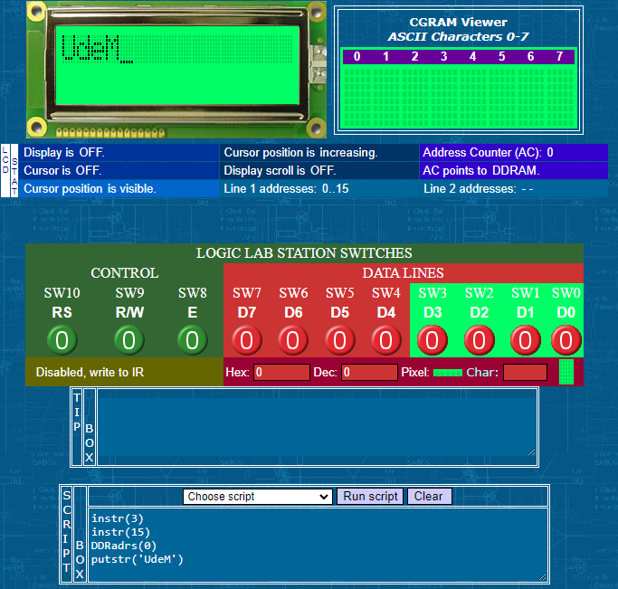
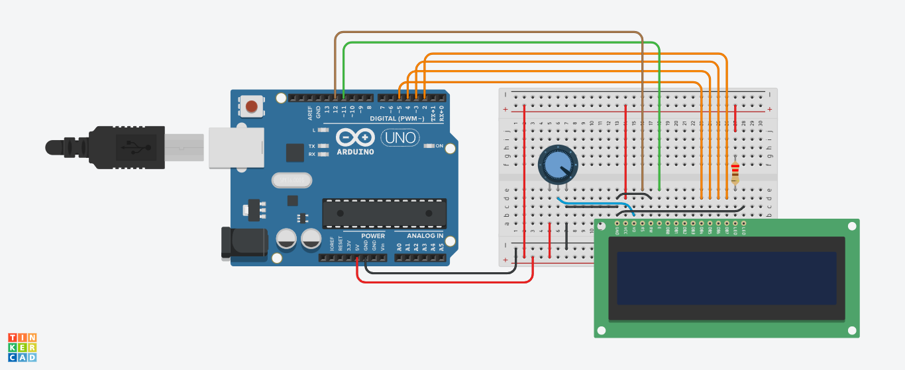
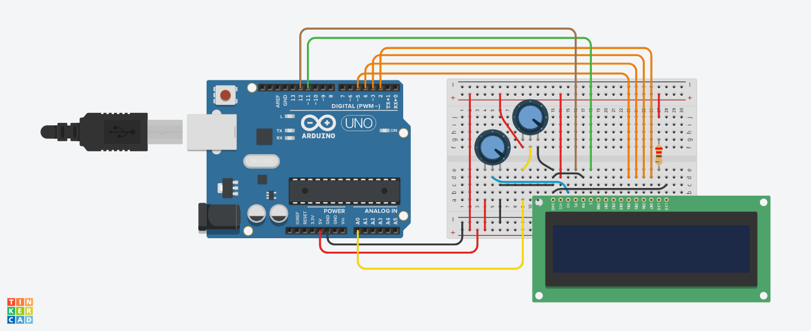

# Manejo del LCD

## Objetivos

> * Objetivo 1.
> * Objetivo 2.
> * Objetivo 3.

## Antes de empezar

Referencias principales:

1. **Microcontroladores PIC - Programación en BASIC: componentes-adicionales** ([link](https://www.mikroe.com/ebooks/microcontroladores-pic-programacion-en-basic/componentes-adicionales))
2. **Character LCDs - Adafruit** ([link](https://learn.adafruit.com/character-lcds))
3. **Basic Character LCD Hookup Guide - Sparkfun** ([link](https://learn.sparkfun.com/tutorials/basic-character-lcd-hookup-guide/all))
4. **Random Nerd Tutorials** ([link](https://randomnerdtutorials.com/projects-arduino/))
5. **SparkFun Inventor's Kit Experiment Guide - v4.0 --> Project 4: Display** ([link](https://learn.sparkfun.com/tutorials/sparkfun-inventors-kit-experiment-guide---v40/project-4-display))

## Sobre los displays LCD

### Pines y conexión

La siguiente figura muestra un LCD 16x2 con sus respectivos pines de interfaz:


La descripción de cada uno de los pines se muestra en la siguiente tabla:

|Función|Pin|Nombre|Estado Lógico|Descripción|
|---|---|---|:---:|---|
|Tierra (**GND**)|1|**VSS**|-|0V|
|Alimentación|2|**VDD**|-|+5V|
|Contraste|3|**VEE** o **V0**|-|0 - VDD|
|Control de funcionamiento|4|**RS**|0/1|<ul><li>**RS=0**: D0 – D7 considerados como comandos<li>**RS=1**: D0 – D7 considerados como datos</ul>|
|Control de funcionamiento|5|**R/W**|0/1|<ul><li>**RS=0**: Escribir los datos (del microcontrolador al LCD)<li>**RS=1**: Leer los daots (del LCD al microcontrolador)</ul>|
|Control de funcionamiento|6|**E**|Transición de 0 a 1|<ul><li>**E=0**: Acceso al visualizador LCd deshabilitado<li>**E=1**: Funcionamiento normal Datos/comandos se están transmitiendo al LCD</ul>|
|Datos / Comandos|7|**D0**|0 / 1|Bit 0 LSB|
|Datos / Comandos|8|**D1**|0 / 1|Bit 1|
|Datos / Comandos|9|**D2**|0 / 1|Bit 2|
|Datos / Comandos|10|**D3**|0 / 1|Bit 3|
|Datos / Comandos|11|**D4**|0 / 1|Bit 4|
|Datos / Comandos|12|**D5**|0 / 1|Bit 5|
|Datos / Comandos|13|**D6**|0 / 1|Bit 6|
|Datos / Comandos|14|**D7**|0 / 1|Bit 7 MSB|
|Alimentación positiva del backlight|15|**K**|-|0V|
|Alimentación negativa del backlight|16|**A**|-|+5V|

La siguiente figura muestra la forma conexión tipica entre un LCD y un microcontrolador:


Tal y como se resalta en la figura, es posible usar o no todas las lineas de datos del LCD y de esto depende el tipo de conexión la cual puede ser:
* **Conexión a 4 lineas**: Los bits de datos menos significativos (**D0-D3**) no se conectan.
* **Conexión a 8 lineas**: Se conectan todos los pines asociados a los bits de datos.

Los display LCD que normalmente se suelen usar, emplean el controlador **Hitachi HD44780**. El datasheet del controlador Hitachi HD44780 ([link](https://www.sparkfun.com/datasheets/LCD/HD44780.pdf)) contiene toda la información sobre la estructura, comunicación y control del LCD y por lo tanto, es una guia obligada cuando se desea diseñar un driver desde cero. El estudio de esta información se sale de los objetivos de esta guia (y hasta nos da tres vueltas) de modo que no se tratara en detalle. Sin embargo es util hablar de algunos aspectos basicos del controlador Hitachi.

### Memoria del controlador Hitachi HD44780

El controlador Hitachi HD44780 tiene tres localizaciones de memoria principales:
* **DDRAM (Data Display Random Access Memory)**: La memoria DDRAM se utiliza para almacenar los caracteres a visualizar. Tiene una capacidad de almacenar 80 caracteres.
  
  

* **CGROM (Character Generation Read Only Memory)**: Esta memoria contiene un mapa estándar de todos los caracteres que se pueden visualizar en la pantalla. A cada carácter se le asigna lugar de memoria, las direcciones de cada uno de los caracteres son los numeros de cada uno de los caracteres ASCCI ([tabla ASCII](https://www.asciitable.com/)):
  
  

* **CGRAM (Character Generation Random Access Memory)**: En esta región de 64 bytes se almacenan los caracteres definidos por el usuario (personalizados). El usario puede definir hasta 8 caracteres de 5x8 pixeles. Para esto, se utiliza los 5 bits mas bajos de cada registro (de 8 bits) para definir los puntos oscuros (1) de cada fila que conforma el caracter el cual, agrupa un total de ocho filas (registros).
  
  

### Comandos básicos

Todos los datos transmitidos a un display LCD por las salidas D0-D7 serán interpretados como un comando o un dato dependiendo del estado logico de pin **RS**:
* **RS = 1**: Los bits D0 - D7 son direcciones de los caracteres a visualizar. En este caso, el controlado del LCD direcciona un carácter seleccionado y lo visualiza en la dirección especificada en la DDRAM la cual se define antes de transmitir el carácter, o en caso contrario se toma con base en la dirección del carácter anteriormente transmitido la cual se aumenta automaticamente.
* **RS = 0**: Los bits D0 - D7 son empleados como comandos para ajustar el modo del visualización.

La siguiente tabla muestra una linea de comandos para el LCD:

<table>
    <thead>
        <tr>
            <th>Comando</th>
            <th>RS</th>
            <th>RW</th>
            <th>D7</th>
            <th>D6</th>
            <th>D5</th>
            <th>D4</th>
            <th>D3</th>
            <th>D2</th>
            <th>D1</th>
            <th>D0</th>
        </tr>
    </thead>
    <tbody>
        <tr>
            <td>Borrar el visualizador</td>
            <td>0</td>
            <td>0</td>
            <td>0</td>
            <td>0</td>
            <td>0</td>
            <td>0</td>
            <td>0</td>
            <td>0</td>
            <td>0</td>
            <td>1</td>
        </tr>
        <tr>
            <td>Poner el cursor al inicio</td>
            <td>0</td>
            <td>0</td>
            <td>0</td>
            <td>0</td>
            <td>0</td>
            <td>0</td>
            <td>0</td>
            <td>0</td>
            <td>1</td>
            <td>x</td>
        </tr>
        <tr>
            <td>Modo de entrada</td>
            <td>0</td>
            <td>0</td>
            <td>0</td>
            <td>0</td>
            <td>0</td>
            <td>0</td>
            <td>0</td>
            <td>1</td>
            <td>I/D</td>
            <td>S</td>
        </tr>
        <tr>
            <td>Activar/desactivar el visualizador</td>
            <td>0</td>
            <td>0</td>
            <td>0</td>
            <td>0</td>
            <td>0</td>
            <td>0</td>
            <td>1</td>
            <td>D</td>
            <td>U</td>
            <td>B</td>
        </tr>
        <tr>
            <td>Desplazar el cursor/visualizador</td>
            <td>0</td>
            <td>0</td>
            <td>0</td>
            <td>0</td>
            <td>0</td>
            <td>1</td>
            <td>D/C</td>
            <td>R/L</td>
            <td>x</td>
            <td>x</td>
        </tr>
        <tr>
            <td>Modo de funcionamiento</td>
            <td>0</td>
            <td>0</td>
            <td>0</td>
            <td>0</td>
            <td>1</td>
            <td>DL</td>
            <td>N</td>
            <td>F</td>
            <td>x</td>
            <td>x</td>
        </tr>
        <tr>
            <td>Establecer la dirección CGRAM</td>
            <td>0</td>
            <td>0</td>
            <td>0</td>
            <td>1</td>
            <td colspan=7>Dirección CGRAM</td>
        </tr>
        <tr>
            <td>Establecer la dirección DDRAM</td>
            <td>0</td>
            <td>0</td>
            <td>1</td>
            <td colspan=8>Dirección DDRAM</td>
        </tr>
        <tr>
            <td>Leer la bandera "BUSY"(ocupado) (BF)</td>
            <td>0</td>
            <td>1</td>
            <td>BF</td>
            <td colspan=8>Dirección DDRAM</td>
        </tr>
        <tr>
            <td>Escribir en la CGRAM o en la DDRAM</td>
            <td>1</td>
            <td>0</td>
            <td>D7</td>
            <td>D6</td>
            <td>D5</td>
            <td>D4</td>
            <td>D3</td>
            <td>D2</td>
            <td>D1</td>
            <td>D0</td>
        </tr>
        <tr>
            <td>Leer la CGRAM o la DDRAM</td>
            <td>1</td>
            <td>1</td>
            <td>D7</td>
            <td>D6</td>
            <td>D5</td>
            <td>D4</td>
            <td>D3</td>
            <td>D2</td>
            <td>D1</td>
            <td>D0</td>
        </tr>
    </tbody>
</table>

**Donde**:
> * **I/D**
>   * 1 = Incremento (por 1)
>   * 0 = Decremento (por 1)
> * **R/L**
>   * 1 = Desplazamiento a la derecha
>   * 0 = Desplazamiento a la izquierda
> * **S**
>   * 1 = Desplazamiento del visualizador activado
>   * 0 = Desplazamiento del visualizador desactivado
> * **DL**
>   * 1 = Bus de datos de 8 bits
>   * 0 = Bus de datos de 4 bits
> * **D**
>   * 1 = Visualizador encendido  
>   * 0 = Visualizador apagado
> * **N**
>   * 1 = Visualizar en dos lineas
>   * 0 = Visualizar en una linea
> * **U**
>   * 1 = Cursor activado
>   * 0 = Cursor desactivado
> * **F**
>   * 1 = Carácter de 5x8 puntos
>   * 0 = Carácter de 5x7 puntos
> * **B**
>   * 1 = Parpadeo del cursor encendido
>   * 0 = Parpadeo del cursor apagado
> * **D/C**
>   * 1 = Desplazamiento del visualizador
>   * 0 = Desplazamiento del cursor

### Bandera de ocupado (BF - BUSY FLAG)

Es una señal que indica que el display esta listo para recibir el siguiente dato, despues de ejecutado un comando. Esta señal se puede leer de la línea D7 y cuando su valor es de 0V (**BF=0**) indica que el display esta listo para recibir un nuevo comando.

### Rutina de inicialización

Al encender la fuente de alimentación, el LCD se reinicia automáticamente. Esto dura aproximadamente 15mS. Después de eso, el LCD está listo para funcionar. Por lo general, el reinicio automático se lleva a cabo sin problemas. Sin embargo, cuando esto no se da, existen dos algoritmos de inicialización que dependen de la conexión hecha entre en microcontrolador y el bus de datos (4 o 8 lineas). La siguientes figuras muestran las instrucciones que se llevan en cada caso:

* **Inicialización con conexion a 8 lineas**
  
  

* **Inicialización con conexion a 4 lineas**

  

El el siguiente [link](https://people.ucalgary.ca/~smithmr/2015webs/encm511_15/15_Labs/SimulationForLab4/djlcdsim1/djlcdsim.html) se encuentra un simulador muy util para comprender todo lo anterior. En la siguiente figura se muestra como resultado en el display **UdeM** al aplicar las instrucciones mostradas a continuación:

```
instr(3)
instr(15)
DDRadrs(0)
putstr('UdeM')
```



Para evitar el gorroso procedimiento para desplegar los caracteres anteriores existen los drivers, los cuales para el caso del arduino estan implementados. Esto facilita enormemente la tarea de controlar el display LCD.

## Manejo del LCD usando Arduino

Afortunadamente no es necesario implementar...
Las funciones se encuentran en la libreria https://www.arduino.cc/reference/en/libraries/liquidcrystal/


|Función|Descripción|
|---|---|
|[```LiquidCrystal()```](https://www.arduino.cc/reference/en/libraries/liquidcrystal/liquidcrystal/)|Crea un objeto tipo ```LiquidCrystal``` para controlar el display. El display puede ser controlado usando usando una conexión a 4 (para lo cual se dejan sin conectar **D0-D3**) u 8 lineas. Adicionalmente, el pin **RW** lo cual permite que sea omitido como parametro de la función<br><br>**Sintaxis**:<br>```LiquidCrystal(rs, enable, d4, d5, d6, d7)``` <br>```LiquidCrystal(rs, rw, enable, d4, d5, d6, d7)```<br>```LiquidCrystal(rs, enable, d0, d1, d2, d3, d4, d5, d6, d7)```<br>```LiquidCrystal(rs, rw, enable, d0, d1, d2, d3, d4, d5, d6, d7)```<br><br>**Parámetros**: <ul><li>**```rs```**: Numero del pin del arduino conectado al pin **RS** del LCD<li>**```rw```**: Numero del pin del arduino conectado al pin **RW** del LCD<li>**```enable```**: Numero del pin del arduino conectado al pin **E** del LCD<li>**```d0, d1, d2, d3, d4, d5, d6, d7```**: Numero de los pines del arduino conectado a los correspondientes pines del bus de datos del LCD. Los parametros ```d0, d1, d2, d3``` son  opcionales y son omitidos cuando el LDC se conecta al arduino usando cuatro lineas</ul>|
|[```begin()```](https://www.arduino.cc/reference/en/libraries/liquidcrystal/begin/)|Especifica tipo de display que sera empleado indicando sus dimensiones (filas y columnas)<br><br>**Sintaxis**:<br>```lcd.begin(cols, rows)```<br><br>**Parámetros**: <ul><li>**```lcd```**: Variable tipo ```LiquidCrystal```.<li>**```cols```**: Numero de columnas que tiene el display.<li>**```rows```**: Numero de filas que tiene el display.</ul>|
|[```clear()```](https://www.arduino.cc/reference/en/libraries/liquidcrystal/clear/)|Borra la pantalla del LDC y coloca el cursor en la esquina superior izquierda.<br><br>**Sintaxis**:<br>```lcd.clear()```<br><br>**Parámetros**: <ul><li>**```lcd```**: Variable tipo ```LiquidCrystal```</ul>|
|[```home()```](https://www.arduino.cc/reference/en/libraries/liquidcrystal/home/)|Posiciona el cursor en la parte superior izquierda de la pantalla LCD.<br><br>**Sintaxis**:<br>```lcd.home()```<br><br>**Parámetros**: <ul><li>**```lcd```**: Variable tipo ```LiquidCrystal```</ul>|
|[```setCursor()```](https://www.arduino.cc/reference/en/libraries/liquidcrystal/setcursor/)|Especifica la posición en la que se ubicara el cursor<br><br>**Sintaxis**:<br>```lcd.setCursor(col, row)```<br><br>**Parámetros**: <ul><li>**```lcd```**: Variable tipo ```LiquidCrystal```.<li>**```col```**: Columna en la que se ubicara el cursor (siendo 0 la primera columna).<li>**```row```**: Fila en la que se colocará el cursor (Donde 0 es la primera fila).</ul>|
|[```write()```](https://www.arduino.cc/reference/en/libraries/liquidcrystal/write/)|Escribe un caracter en el LCD<br><br>**Sintaxis**:<br>```lcd.write(data)```<br><br>**Parámetros**: <ul><li>**```lcd```**: Variable tipo ```LiquidCrystal```.<li>**```data```**: Caracter a escribir en el Display.</ul>**Retorno**: Numero de bytes escritos|
|[```print()```]()|Imprime texto en el LCD<br><br>**Sintaxis**:<br>```lcd.print(data)```<br>```lcd.print(data,BASE)```<br><br>**Parámetros**: <ul><li>**```lcd```**: Variable tipo ```LiquidCrystal```.<li>**```data```**: Dato a imprimir (```char```, ```byte```, ```int```, ```long```, or ```string```).<li>**```BASE```**: Parametro opcional para definir la **BASE** en la que se muestran los numeros (```BIN```, ```DEC```, ```OCT```, ```HEX```, or ```string```).</ul>**Retorno**: Numero de bytes escritos|
|[```cursor()```](https://www.arduino.cc/reference/en/libraries/liquidcrystal/print/)|Muestra el cursor en el LCD<br><br>**Sintaxis**:<br>```lcd.cursor()```<br><br>**Parámetros**: <ul><li>**```lcd```**: Variable tipo ```LiquidCrystal```</ul>|
|[```noCursor()```](https://www.arduino.cc/reference/en/libraries/liquidcrystal/nocursor/)|Oculta el cursor<br><br>**Sintaxis**:<br>```lcd.noCursor()```<br><br>**Parámetros**: <ul><li>**```lcd```**: Variable tipo ```LiquidCrystal```</ul>|
|[```blink()```](https://www.arduino.cc/reference/en/libraries/liquidcrystal/blink/)|Muestra el cursor parpadeando<br><br>**Sintaxis**:<br>```lcd.blink()```<br><br>**Parámetros**: <ul><li>**```lcd```**: Variable tipo ```LiquidCrystal```</ul>|
|[```noBlink()```](https://www.arduino.cc/reference/en/libraries/liquidcrystal/noblink/)|Apaga el parpadeo del cursor<br><br>**Sintaxis**:<br>```lcd.noBlink()```<br><br>**Parámetros**: <ul><li>**```lcd```**: Variable tipo ```LiquidCrystal```</ul>|
|[```display()```](https://www.arduino.cc/reference/en/libraries/liquidcrystal/display/)|Enciende la pantalla del LCD, después de apagarla con ```noDisplay()```.<br><br>**Sintaxis**:<br>```lcd.display()```<br><br>**Parámetros**: <ul><li>**```lcd```**: Variable tipo ```LiquidCrystal```</ul>|
|[```noDisplay()```](https://www.arduino.cc/reference/en/libraries/liquidcrystal/nodisplay/)|Apaga la pantalla del display. El texto que se encuentra en esta no se pierde.<br><br>**Sintaxis**:<br>```lcd.noDisplay()```<br><br>**Parámetros**: <ul><li>**```lcd```**: Variable tipo ```LiquidCrystal```</ul>|
|[```scrollDisplayLeft()```](https://www.arduino.cc/reference/en/libraries/liquidcrystal/scrolldisplayleft/)|Desplaza el contenido del display (texto y cursor) un espacio a la izquierda.<br><br>**Sintaxis**:<br>```lcd.scrollDisplayLeft()```<br><br>**Parámetros**: <ul><li>**```lcd```**: Variable tipo ```LiquidCrystal```</ul>|
|[```scrollDisplayRight()```](https://www.arduino.cc/reference/en/libraries/liquidcrystal/scrolldisplayright/)|Desplaza el contenido del display (texto y cursor) un espacio a la derecha.<br><br>**Sintaxis**:<br>```lcd.scrollDisplayRight()```<br><br>**Parámetros**: <ul><li>**```lcd```**: Variable tipo ```LiquidCrystal```</ul>|
|[```autoScroll()```](https://www.arduino.cc/reference/en/libraries/liquidcrystal/autoscroll/)|Activa el desplazamiento automatico del contenido del display.<br><br>**Sintaxis**:<br>```lcd.autoScroll()```<br><br>**Parámetros**: <ul><li>**```lcd```**: Variable tipo ```LiquidCrystal```</ul>|
|[```noAutoScroll()```](https://www.arduino.cc/reference/en/libraries/liquidcrystal/noautoscroll/)|Desactiva el desplazamiento automatico del contenido del display.<br><br>**Sintaxis**:<br>```lcd.noAutoScroll()```<br><br>**Parámetros**: <ul><li>**```lcd```**: Variable tipo ```LiquidCrystal```</ul>|
|[```leftToRight()```](https://www.arduino.cc/reference/en/libraries/liquidcrystal/lefttoright/)|Establece la dirección en que se escribe el texto en el display de izquierda a derecha (default).<br><br>**Sintaxis**:<br>```lcd.leftToRight()```<br><br>**Parámetros**: <ul><li>**```lcd```**: Variable tipo ```LiquidCrystal```</ul>|
|[```rightToLeft()```](https://www.arduino.cc/reference/en/libraries/liquidcrystal/righttoleft/)|Establece la dirección en que se escribe el texto en el display de derecha a izquierda.<br><br>**Sintaxis**:<br>```lcd.rightToLeft()```<br><br>**Parámetros**: <ul><li>**```lcd```**: Variable tipo ```LiquidCrystal```</ul>|
|[```createChar()```](https://www.arduino.cc/reference/en/libraries/liquidcrystal/createchar/)|Crea un carácter personalizado (glyph) para ser usado en el LCD. Se admiten hasta ocho caracteres de 5x8 píxeles (numeradas del 0 al 7). La apariencia de cada caracter se define en un arreglo de 8 bytes, uno por cada fila. Los cinco bits menos significativos de cada byte determinan los pixeles en esa fila. Para mostrar un caracter personalizado en el display se usa la función ```write``` con el numero del caracter personalizado (0-7) que se quiere mostrar<br><br>**Sintaxis**:<br>```lcd.createChar(num, data)```<br><br>**Parámetros**: <ul><li>**```lcd```**: Variable tipo ```LiquidCrystal```<li>**```num```**: Numero del caracter a crear (0-7) <li>**```data```**: Matrix de pixeles del dato a crear </ul>|

Como herramientas de apoyo para facilitar la generación de caracteres personalizados se recomienda el uso de las siguientes:
1. Custom Character Generator for HD44780 LCD Modules ([link](http://omerk.github.io/lcdchargen/))
2. HD44780 LCD User-Defined Graphics ([link](https://www.quinapalus.com/hd44780udg.html))

## Ejemplos

### Ejemplo Arduino

Los siguientes ejemplos son tomados de la pagina **Liquid Crystal Displays (LCD) with Arduino** ([link](https://docs.arduino.cc/learn/electronics/lcd-displays)) de Arduino y replicados en tinkercad para facilitar su comprensión. El esquematico de los ejemplos se muestra a continuación:


El montaje asociado a este esquematico se muestra en la siguiente figura:



1. **Hello World Example**: En este ejemplo imprime la palabra ```Hello World!``` al LCD y muestra el tiempo en segundos desde que el arduino fue reseteado ([link](https://www.tinkercad.com/things/8wVWGzEreen)).
2. **Autoscroll Example**: Este ejemplo muestra como usar los metodos ```autoscroll()``` y ```noAutoscroll()``` para mover todo el texto que se muestra en el display de izquierda a derecha:
   * **```autoscroll()```**: Mueve todo el texto un espacio a la izquierda una cada vez que una letra es agregada.
   * **```noAutoscroll()```**: Desactiva el **scrolling**
  
   En este ejemplo muestra los caracteres desde el **0** hasta el **9** con el **scrolling** desactivado, luego ubica el cursor en la esquina inferior derecha y activa el **autoscroll** imprimiendo los numeros de nuevo ([link](https://www.tinkercad.com/things/l1HyR2Gey5N)).
3. **Blink Example**: Este ejemplo muestra como usar los metodos ```blink()``` y ```noBlink()``` para experimentar con el parpadeo del cursor. ([link](https://www.tinkercad.com/things/fvoQd8V0Z4o)).
4. **Cursor**: Este metodo muestra como usar los métodos ```cursor()``` y ```noCursor()``` para controlar el despliegue del indicador del cursor (Guion bajo: **_** ). ([link](https://www.tinkercad.com/things/3jgEXpPz0qx)).
5. **Display Example**: Este ejemplo muestra como usar los métodos ```display()``` y ```noDisplay()``` para prender y apagar el display. El texto que esta siendo desplegado se mantendra aun cuano se use ```noDisplay()``` de manera que volvera a hacerse visible al emplear ```display()```. ([link](https://www.tinkercad.com/things/5diDpSEoc65)).
6. **Scroll Example**: Este ejemplo muestra como usar los métodos ```scrollDisplayLeft()``` y ```scrollDisplayRight()``` para invertir la dirección el a cual va se mueve el texto. Para esto, imprime ```"Hello World!"``` desplazandolo hacia la izquierda fuera de la pantalla, luego fuera de la pantalla a la derecha y luego desde donde empezo. ([link](https://www.tinkercad.com/things/9Wa0aLzWkqJ)).
7. **Serial to Display Example**: En este ejemplo se reciben datos por serial desde un PC (desde el monitor serial por ejemplo) y se despliegan en el Display LCD. ([link](https://www.tinkercad.com/things/b0ZvPqfRHVw)).
8. **Set Cursor Example**: Este ejemplo muestra como usar el método ```setCursor()``` para reposicionar el cursor ([link](https://www.tinkercad.com/things/4Zb4dGUQUe4)).. A continuación se muestran algunos ejemplos de uso de este método:
   
   ```ino
   lcd.setCursor(0, 0); // top left
   lcd.setCursor(15, 0); // top right
   lcd.setCursor(0, 1); // bottom left
   lcd.setCursor(15, 1); // bottom right
   ```

9. **Text Direction Example**: Este ejemplo muestra como usar los métodos ```leftToRight()``` y ```rightToLeft()``` para controlar la forma como aparece el texto a partir del cursor.
   * ```rightToLeft()``` hace que el texto aparezca a la izquierda desde el cursor, como si la pantalla estuviera justificada a la derecha.
   * ```leftToRight()``` hace que el texto fluya hacia la derecha desde el cursor, como si la pantalla estuviera justificada a la izquierda.

   Para esto, en el ejemplo se imprime desde la ```a``` a la ```l``` de derecha a izquierda, luego desde la ```m``` a la ```r``` de izquierda a derecha y luego desde la ```s``` a la ```z``` de derecha a izquierda de nuevo ([link](https://www.tinkercad.com/things/axuK9KW7Ulx))..

10. **Custom Character**: Este ejemplo demuestr como emplear agregar caracteres personalizados en un display LCD. Para este ejemplo, se requiere un potenciometro adicional conectado a la pin ```A0``` del ardunino. Este potenciometro controla la variable ```delayTime```. ([link](https://www.tinkercad.com/things/jHnGf46o4xH)).
    
    
    


## Referencias

1. https://www.mikroe.com/ebooks/microcontroladores-pic-programacion-en-basic
2. https://docs.arduino.cc/learn/electronics/lcd-displays
3. https://makeabilitylab.github.io/physcomp/arduino/
4. https://learn.adafruit.com/character-lcds
5. https://learn.sparkfun.com/tutorials/basic-character-lcd-hookup-guide/all
6. https://makeabilitylab.cs.washington.edu/
7. https://k12maker.mit.edu/physical-computing.html
8. https://www.instructables.com/member/EdgertonCenter/
9. https://guides.temple.edu/c.php?g=419841&p=2863656
10. https://wiki.ead.pucv.cl/Physical_Computing_-_UAI
11. https://arduinotogo.com/
12. https://github.com/arm-university/Smart-School-Projects
13. https://github.com/moritzsalla/phys-comp
14. https://www.ecarleton.ca/course/view.php?id=38
15. https://blogs.uw.edu/hcdepcom/projects/proj13/smart-home-arduino
16. http://oomlout.com/oom.php/index.htm
17. https://www.jodyculkin.com/category/pcomp
18. https://people.ucalgary.ca/~smithmr/2015webs/encm511_15/
19. https://docs.arduino.cc/learn/electronics/lcd-displays
20. https://naylampmechatronics.com/blog/34_tutorial-lcd-conectando-tu-arduino-a-un-lcd1602-y-lcd2004.html
21. https://www.bolanosdj.com.ar/SOBRELCD/TEORIALCDV1.pdf
22. https://www.bolanosdj.com.ar/MOVIL/ARDUINO2/EjemploLCD.pdf
23. https://naylampmechatronics.com/blog/34_tutorial-lcd-conectando-tu-arduino-a-un-lcd1602-y-lcd2004.html
24. https://learn.sparkfun.com/tutorials/basic-character-lcd-hookup-guide/all
25. https://www.quinapalus.com/hd44780udg.html
26. https://randomnerdtutorials.com/esp32-esp8266-i2c-lcd-arduino-ide/
27. http://www.dinceraydin.com/djlcdsim/djlcdsim.html
28. https://www.adafruit.com/product/181
29. https://learn.adafruit.com/character-lcds
30. https://learn.adafruit.com/light-meter
31. https://wiki.seeedstudio.com/Grove-16x2_LCD_Series/
32. https://makeabilitylab.github.io/physcomp/arduino/
33. https://users.cs.utah.edu/~elb/Papers/PhysicalComputingTalk.pdf
34. https://pdm.lsupathways.org/4_physicalcomputing/
35. https://www.uet.edu.pk/pp/ee/~mtahir/EE371/EE371_Fall2014.html